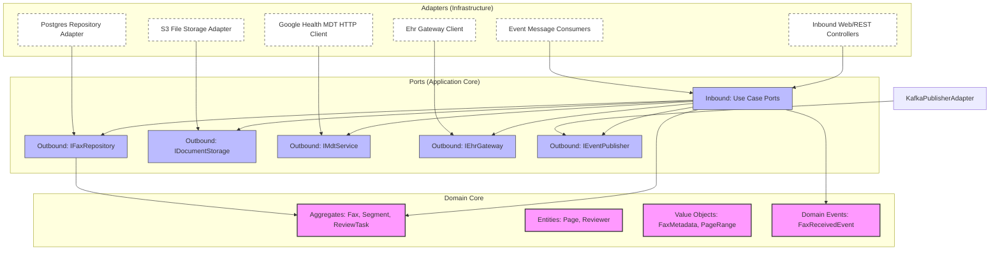
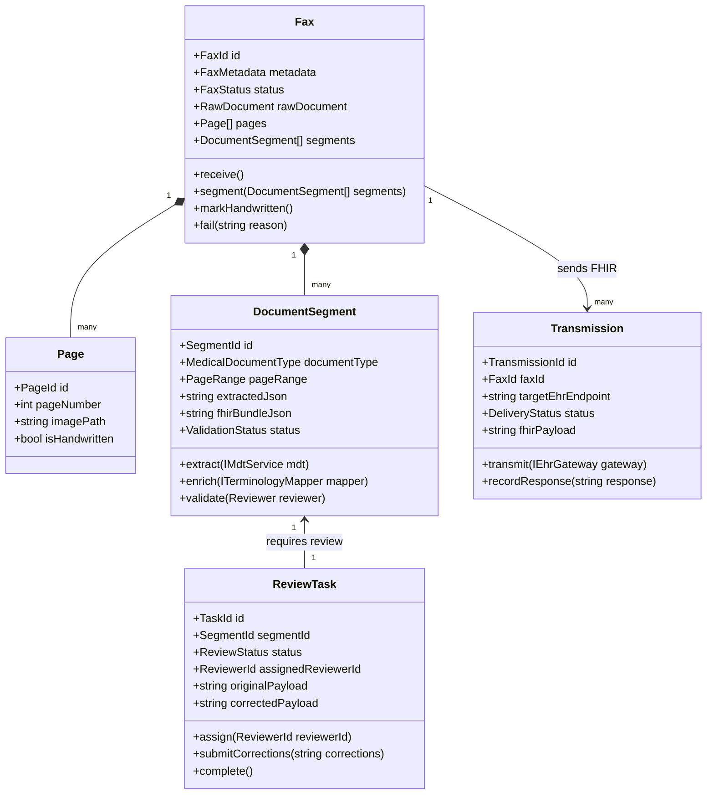
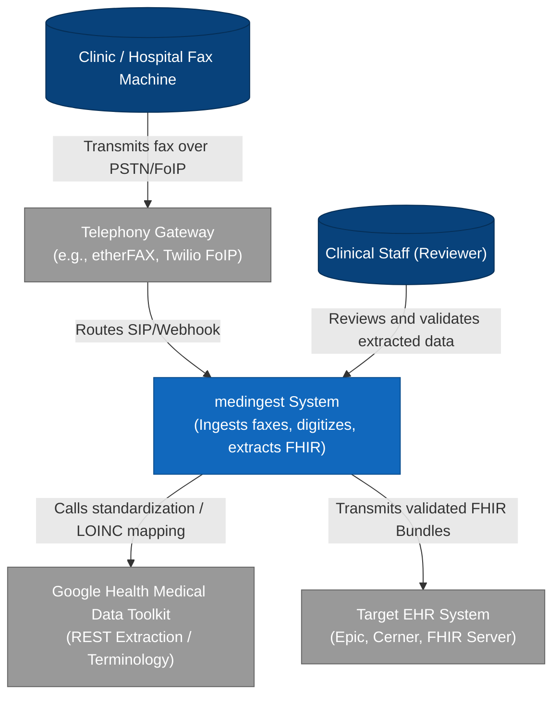
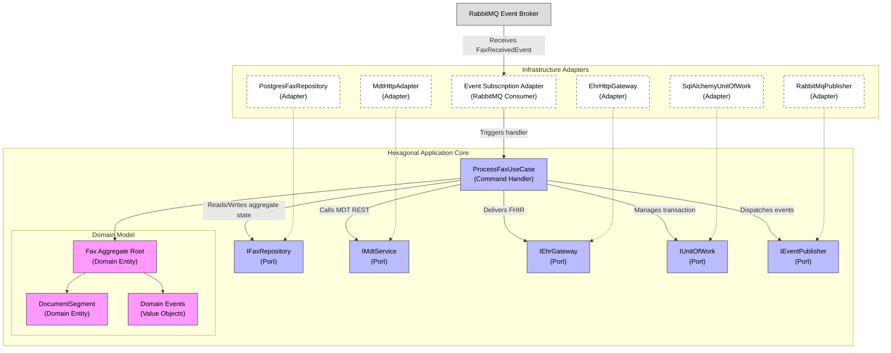
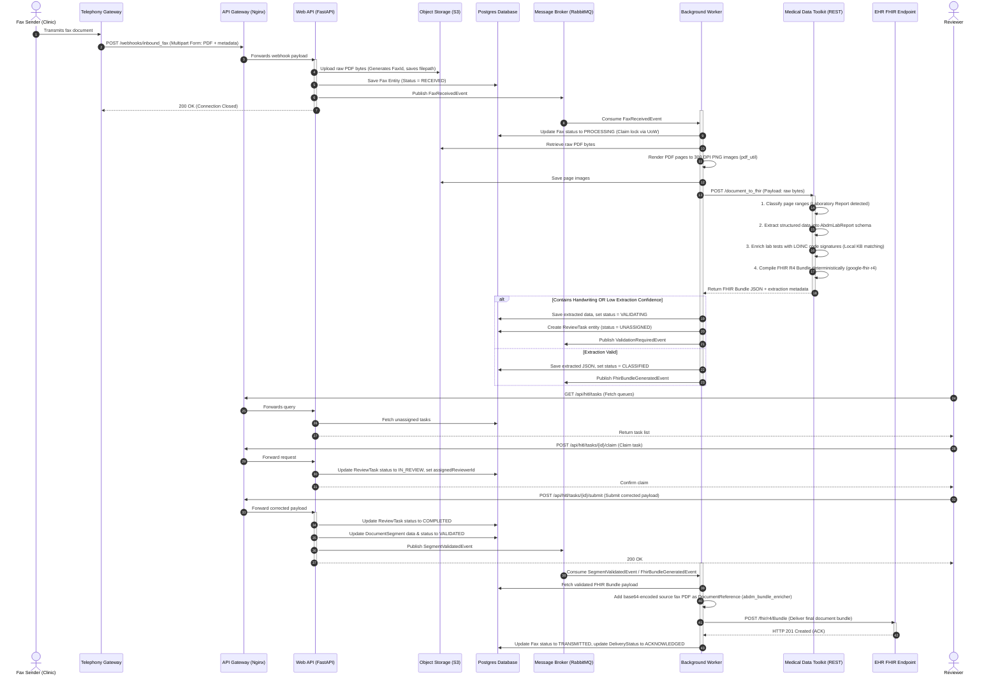

# medingest Digital Fax Ingestion System: Architecture Design

This document details the architectural and engineering design for **medingest**, a digital fax ingestion, processing, and electronic health record (EHR) transmission system. The architecture is designed to handle unstructured clinical faxes by combining **Clean Architecture**, **Domain-Driven Design (DDD)**, **Hexagonal (Ports and Adapters) Architecture**, **SOLID Principles**, and **Event-Driven Architecture (EDA)**.

To automate document classification, data extraction, and clinical coding, medingest integrates the **Google Health Medical Data Toolkit (MDT)** as a core adapter.

---

## 1. Architectural Philosophy & Principles

The medingest architecture enforces strict boundaries between business logic and infrastructure.



### A. Core Architecture Patterns

1. **Domain-Driven Design (DDD)**: Logic is structured around Bounded Contexts. Complex business rules are encapsulated inside Aggregates, Entities, and Value Objects. Domain events trigger cross-context workflows.
2. **Hexagonal Architecture (Ports and Adapters)**:
   - **Ports (Interfaces)**: Inbound ports represent application use cases (driving). Outbound ports represent system capability abstractions like database repositories, file storage, and remote APIs (driven).
   - **Adapters (Implementations)**: Infrastructure adapters implement outbound ports (e.g. PostgreSQL repository database client) or route inputs to inbound ports (e.g. REST API controllers).
3. **Clean Architecture (Dependency Rule)**: Source code dependencies point inward. The domain layer has zero knowledge of databases, web frameworks, messaging systems, or external HTTP clients.
4. **SOLID Principles**:
   - _Single Responsibility Principle (SRP)_: Components are highly cohesive. Use cases map to single, isolated actions (e.g., `ProcessFaxUseCase`).
   - _Open/Closed Principle (OCP)_: Extending functionalities (such as adding a US Core FHIR converter or new OCR vendor adapters) is done by adding new adapter implementations rather than editing core domain logic.
   - _Liskov Substitution Principle (LSP)_: Outbound ports are designed so that mock adapters, local file adapters, or cloud adapters can be swapped seamlessly in tests or different deployments.
   - _Interface Segregation Principle (ISP)_: Ports are small and purpose-specific (e.g. separating read-only queries from transaction write-backs).
   - _Dependency Inversion Principle (DIP)_: Core use cases depend on interfaces (Ports), and the infrastructure adapters depend on those same interfaces. Dependency injection compiles the graphs at boot time.
5. **Event-Driven Architecture (EDA)**: System containers communicate asynchronously using message queues. Use cases emit domain events that are captured and mapped to message brokers, decoupling ingestion from extraction and transmission.

---

## 2. Domain Model & Aggregates

medingest is decomposed into three main Bounded Contexts: **Ingestion**, **Processing**, and **Clinical Validation (Human-in-the-Loop)**.



### A. Aggregates & Domain Entities

#### 1. Fax (Aggregate Root - Ingestion Context)

- **Description**: Represents the raw incoming fax transmission. It manages the file payload, validates the page boundaries, and coordinates segment separation.
- **Entities**:
  - `Page`: Represents a single page of the fax, containing the page number, raw rendered image path, and a handwriting flag.
  - `DocumentSegment`: Represents a continuous range of pages that belong to a single clinical document type (e.g. Page 1-2 is a Lab Report).
- **Value Objects**:
  - `FaxId`: UUID wrapper.
  - `FaxMetadata`: `SenderNumber`, `ReceiverNumber`, `Timestamp`, `PageCount`, `CallId`.
  - `RawDocument`: `FilePath`, `FileHash`, `MimeType`.
- **State Machine (`FaxStatus`)**:
  `Received` $\rightarrow$ `Processing` $\rightarrow$ `Classified` $\rightarrow$ `Validating` $\rightarrow$ `Transmitted` (or `Failed`).

#### 2. ReviewTask (Aggregate Root - Clinical Validation Context)

- **Description**: Manages the life cycle of human-in-the-loop validation for failed extractions, high-percentage handwriting segments, or low-confidence classification steps.
- **State Machine (`ReviewStatus`)**:
  `Unassigned` $\rightarrow$ `Assigned` $\rightarrow$ `InReview` $\rightarrow$ `Completed` (or `Escalated`).

#### 3. Transmission (Aggregate Root - Integration Context)

- **Description**: Encapsulates the transactional status of delivery of a generated FHIR bundle to a target EHR system.
- **State Machine (`DeliveryStatus`)**:
  `Pending` $\rightarrow$ `Sent` $\rightarrow$ `Acknowledged` (or `Retrying` $\rightarrow$ `Failed`).

### B. Domain Events

Domain events are immutable structures capturing business actions. They decouple aggregates across context boundaries:

- `FaxReceivedEvent`: Dispatched when raw fax bytes are written to storage. Triggers PDF rendering and classification.
- `FaxSegmentedEvent`: Dispatched when the classifier identifies document partitions.
- `ExtractionCompletedEvent`: Dispatched when structured clinical data is successfully parsed.
- `ValidationRequiredEvent`: Dispatched when a segment fails validation rules, triggering the creation of a `ReviewTask`.
- `SegmentValidatedEvent`: Dispatched when a reviewer completes a `ReviewTask`.
- `FhirBundleGeneratedEvent`: Dispatched when a segment is successfully translated to FHIR format.
- `FhirBundleTransmittedEvent`: Dispatched when the target EHR system returns an HTTP 201 Created or ACK.

---

## 3. C4 Architecture Diagrams

### A. Level 1: System Context Diagram

Shows how the medingest system interacts with users and external services.



### B. Level 2: Container Diagram

Decomposes medingest into distinct deployable processes and storage nodes.

```mermaid
graph TD
    classDef container fill:#438DD5,stroke:#306295,color:#fff;
    classDef db fill:#1168BD,stroke:#0B4E8F,color:#fff;
    classDef ext fill:#999,stroke:#666,color:#fff;

    Twilio["Telephony Gateway"]:::ext
    Ehr["Ehr System (Epic/Cerner)"]:::ext
    Mdt["Medical Data Toolkit REST API"]:::ext
    Clinician["Clinical Staff Web Browser"]:::ext

    subgraph "medingest System Boundaries"
        Nginx["API Gateway & Static Server\n(Nginx)"]:::container
        Spa["Review Portal SPA\n(React/JS)"]:::container
        WebApi["Hexagonal API Container\n(Python/FastAPI)"]:::container
        Worker["Background Processing Worker\n(Celery / Python)"]:::container
        Broker["Message Broker\n(RabbitMQ)"]:::container
        Postgres[( "Primary Database\n(PostgreSQL)" )]:::db
        S3[( "Object Storage\n(MinIO / AWS S3)" )]:::db
    end

    %% Web UI flow
    Clinician -- Accesses UI --> Nginx
    Nginx -- Serves SPA assets --> Spa
    Spa -- Calls API (REST/GraphQL) --> Nginx
    Nginx -- Proxy pass requests --> WebApi

    %% Web API Database/Storage Flow
    WebApi -- Reads/Writes state --> Postgres
    WebApi -- Publishes commands/events --> Broker

    %% Telephony Ingestion
    Twilio -- Sends Fax Webhook request --> Nginx
    Nginx -- Routes Webhook --> WebApi
    WebApi -- Saves raw file --> S3

    %% Broker to Worker Ingestion
    Broker -- Dispatches jobs --> Worker
    Worker -- Accesses files --> S3
    Worker -- Invokes HTTP POST --> Mdt
    Worker -- Processes & updates state --> Postgres
    Worker -- Transmits FHIR bundles --> Ehr

    class Nginx,Spa,WebApi,Worker,Broker container;
    class Postgres,S3 db;
    class Twilio,Ehr,Mdt ext;
```

### C. Level 3: Component Diagram (Processing Worker Container)

Details the internal implementation architecture of the processing worker, showing Ports, Adapters, Domain Core, and UoW.



### D. Level 4: Deployment Diagram

Shows physical hosting nodes and network zones (assuming a high-availability cloud environment).

```mermaid
graph TD
    classDef node fill:#fff,stroke:#333,stroke-width:2px;
    classDef component fill:#438DD5,stroke:#306295,color:#fff;
    classDef db fill:#1168BD,stroke:#0B4E8F,color:#fff;
    classDef ext fill:#999,stroke:#666,color:#fff;

    subgraph "VPC Zone (AWS / GCP)"
        subgraph "Public Ingress Zone"
            ELB["Application Load Balancer"]:::node
        end

        subgraph "Application Kubernetes Cluster (Private Nodes)"
            subgraph "Web App Pods"
                NginxPod["Nginx Static Server"]:::component
            end
            subgraph "API Pods"
                ApiPod["FastAPI App Container"]:::component
            end
            subgraph "Worker Pods"
                CeleryPod["Celery Processing Worker"]:::component
            end
            subgraph "Message Broker Pods"
                RabbitMqPod["RabbitMQ cluster Node"]:::component
            end
        end

        subgraph "Isolated Database Subnets"
            RDS[( "PostgreSQL RDS Instance\n(Multi-AZ)" )]:::db
            S3[( "AWS S3 / GCS bucket\n(Encrypted at rest)" )]:::db
        end

        subgraph "Secure Google Health Namespace"
            MdtPod["Medical Data Toolkit Pod\n(Runs flask/gunicorn server)"]:::component
            MdtVolume[( "/data mount\n(LOINC axis CSVs)" )]:::db
        end
    end

    InternetGateway["Public Internet Gateway"]:::node
    EpicCloud["Epic/Cerner Interconnect Cloud"]:::ext

    %% Connections
    InternetGateway -- Web traffic --> ELB
    ELB -- SSL Termination & Route --> NginxPod
    ELB -- Routes Webhooks --> ApiPod

    NginxPod -- Proxies APIs --> ApiPod
    ApiPod -- Reads/Writes DB --> RDS
    ApiPod -- Uploads fax documents --> S3
    ApiPod -- Publishes event messages --> RabbitMqPod

    RabbitMqPod -- Event messaging --> CeleryPod
    CeleryPod -- Downloads raw files --> S3
    CeleryPod -- Calls extraction (Intra-VPC) --> MdtPod
    MdtPod -- Reads index KBs --> MdtVolume

    CeleryPod -- POSTs FHIR bundles over HTTPS --> EpicCloud

    class RDS,S3,MdtVolume db;
    class NginxPod,ApiPod,CeleryPod,RabbitMqPod,MdtPod component;
    class InternetGateway,ELB node;
    class EpicCloud ext;
```

---

## 4. End-to-End Sequence Diagram

The following sequence diagram traces the path of a multi-page inbound fax containing a laboratory report.



---

## 5. Directory Layout for Implementation

Following Hexagonal Architecture and Domain-Driven Design, the medingest project codebase is structured as follows:

```directory
medingest/
├── config/                         # Deployment environment settings (Dev, Staging, Prod)
├── docker/                         # Dockerfiles for API, Worker, and Nginx reverse proxy
└── src/                            # Application source
    ├── main.py                     # App bootstrap and dependency injection compilation
    ├── domain/                     # Framework-independent Domain Layer
    │   ├── __init__.py
    │   ├── common/                 # Value Objects, Base Entities, Domain Event definitions
    │   │   ├── entity.py
    │   │   ├── value_object.py
    │   │   └── domain_event.py
    │   ├── fax/                    # Fax Ingestion Aggregate Context
    │   │   ├── __init__.py
    │   │   ├── entities.py         # Fax (Aggregate Root), Page, DocumentSegment
    │   │   ├── value_objects.py    # FaxMetadata, PageRange, RawDocument
    │   │   ├── events.py           # FaxReceivedEvent, FaxSegmentedEvent
    │   │   └── exceptions.py       # Domain-specific business rule exceptions
    │   ├── validation/             # Clinical Validation (HITL) Aggregate Context
    │   │   ├── __init__.py
    │   │   ├── entities.py         # ReviewTask (Aggregate Root), Reviewer
    │   │   └── events.py           # ValidationRequiredEvent, SegmentValidatedEvent
    │   └── transmission/           # Transmission Aggregate Context
    │       ├── __init__.py
    │       ├── entities.py         # Transmission (Aggregate Root)
    │       └── events.py           # TransmissionFailedEvent, FhirBundleTransmittedEvent
    ├── application/                # Application Layer (Use Cases and Ports)
    │   ├── __init__.py
    │   ├── ports/                  # Hexagonal Outbound Interface Ports
    │   │   ├── ifax_repository.py  # Outbound persistence contract
    │   │   ├── idocument_storage.py# Outbound file storage contract (S3)
    │   │   ├── imdt_service.py     # Outbound REST integration with Medical Data Toolkit
    │   │   ├── iehr_gateway.py     # Outbound REST transmission gateway to EHRs
    │   │   ├── ievent_publisher.py # Outbound event publisher interface
    │   │   └── iunit_of_work.py    # Outbound transactional Unit of Work port
    │   └── use_cases/              # Command & Query Handlers (Driving Ports)
    │       ├── process_fax/        # Handles PDF page splitting & MDT ingestion workflow
    │       │   ├── commands.py
    │       │   └── handlers.py
    │       ├── receive_fax/        # Handles raw FoIP webhook ingestion
    │       │   ├── commands.py
    │       │   └── handlers.py
    │       ├── submit_review/      # Handles clinician corrections
    │       │   ├── commands.py
    │       │   └── handlers.py
    │       └── get_hitl_queue/     # Read query side (CQRS)
    │           ├── queries.py
    │           └── handlers.py
    └── infrastructure/             # Infrastructure Layer (Adapters)
        ├── __init__.py
        ├── controllers/            # Driving Adapters (REST Controllers)
        │   ├── fax_webhook.py      # Receives Twilio/etherFAX webhooks
        │   ├── hitl_api.py         # Exposes queues & submission routes to SPA
        │   └── health.py
        ├── persistence/            # PostgreSQL / SQLAlchemy Adapters
        │   ├── models.py           # Database tables mapper definition
        │   ├── repository.py       # PostgresFaxRepository implementing IFaxRepository
        │   └── unit_of_work.py     # SqlAlchemyUnitOfWork implementing IUnitOfWork
        ├── storage/                # AWS S3 Storage Adapter
        │   └── s3_document_storage.py # Implements IDocumentStorage interface
        ├── mdt/                    # Google Health MDT API HTTP Client Adapter
        │   └── mdt_client.py       # Implements IMdtService interface
        ├── ehr/                    # Epic/Cerner Integration HTTP Client Adapter
        │   └── ehr_client.py       # Implements IEhrGateway interface
        ├── messaging/              # RabbitMQ / Celery Adapter
        │   ├── publisher.py        # Implements IEventPublisher interface
        │   └── consumers.py        # Broker listeners mapping broker events to commands
        └── di/                     # Dependency Injection Container Configuration
            └── containers.py       # Wires adapters to ports at application startup
```

---

## 6. Implementation Detail: Dependency Injection & Inversion

To ensure the Domain and Application layers are decoupled from framework implementations, medingest uses the **Dependency Inversion Principle**. Below is a Python example of use case wiring utilizing the Dependency Injection pattern:

```python
# =====================================================================
# APPLICATION PORT (Interface - application/ports/imdt_service.py)
# =====================================================================
import abc
from src.domain.fax.entities import DocumentSegment

class IMdtService(abc.ABC):
    @abc.abstractmethod
    def extract_structured_data(self, page_images: list[bytes]) -> tuple[str, str]:
        """Extracts structured JSON and converts to FHIR from page images.

        Returns:
            A tuple of (extracted_json_payload, fhir_bundle_json_payload)
        """
        pass

# =====================================================================
# INFRASTRUCTURE ADAPTER (Implementation - infrastructure/mdt/mdt_client.py)
# =====================================================================
import requests
from src.application.ports.imdt_service import IMdtService

class MdtHttpAdapter(IMdtService):
    def __init__(self, endpoint_url: str, api_key: str):
        self.endpoint_url = endpoint_url
        self.api_key = api_key

    def extract_structured_data(self, page_images: list[bytes]) -> tuple[str, str]:
        # Merge pages back into a single payload or send sequentially
        # Here we POST to the Google Health Medical Data Toolkit REST API
        headers = {"X-API-Key": self.api_key, "Content-Type": "application/pdf"}

        # Simulating PDF assembly for MDT endpoint
        assembled_pdf = self._assemble_images_to_pdf(page_images)
        response = requests.post(
            f"{self.endpoint_url}/document_to_fhir",
            data=assembled_pdf,
            headers=headers
        )
        response.raise_for_status()
        data = response.json()

        # MDT response structures:
        # data["fhir_bundle"] holds the compiled FHIR document bundle JSON
        # data["medical_document"] holds the structured extraction schema JSON
        return str(data.get("medical_document")), str(data.get("fhir_bundle"))

    def _assemble_images_to_pdf(self, images: list[bytes]) -> bytes:
        # PDF assembly logic utilizing PIL
        return b"compiled_pdf_bytes"

# =====================================================================
# CORE USE CASE HANDLER (Use Case - application/use_cases/process_fax/handlers.py)
# =====================================================================
from src.application.ports.ifax_repository import IFaxRepository
from src.application.ports.imdt_service import IMdtService
from src.application.ports.iunit_of_work import IUnitOfWork
from src.application.ports.ievent_publisher import IEventPublisher
from src.domain.fax.events import FaxSegmentedEvent

class ProcessFaxCommandHandler:
    def __init__(
        self,
        fax_repo: IFaxRepository,     # Port Dependency
        mdt_service: IMdtService,     # Port Dependency
        uow: IUnitOfWork,             # Port Dependency
        publisher: IEventPublisher    # Port Dependency
    ):
        self.fax_repo = fax_repo
        self.mdt_service = mdt_service
        self.uow = uow
        self.publisher = publisher

    def handle(self, command) -> None:
        with self.uow:
            fax = self.fax_repo.get_by_id(command.fax_id)
            if not fax:
                raise ValueError("Fax not found.")

            # Business validation logic inside Domain core
            fax.mark_processing()
            self.fax_repo.save(fax)

            # Fetch page images
            images = [page.image_path for page in fax.pages]

            # Call outbound port (Adapter executes HTTP call externally)
            extracted_json, fhir_json = self.mdt_service.extract_structured_data(images)

            # Update Domain Aggregate Root
            fax.add_extracted_segment(
                document_type=fax.classified_type,
                extracted_json=extracted_json,
                fhir_json=fhir_json
            )

            self.fax_repo.save(fax)
            self.uow.commit() # Save Postgres state and release locks

            # Publish Domain Event to broker
            self.publisher.publish(FaxSegmentedEvent(fax.id, fax.segments))
```

---

## 7. Implementation Detail: CQRS & Unit of Work

To optimize performance and database concurrency, medingest decouples commands (writes) from queries (reads):

1. **Command Side**:
   - Executed using the `UnitOfWork` (e.g. `SqlAlchemyUnitOfWork`).
   - Fetches full Domain Aggregate objects, maps modifications, validates business invariants, commits data, and dispatches events.
   - Leverages optimistic concurrency control (version numbers) in PostgreSQL.
2. **Query Side**:
   - Bypasses the DDD repository abstraction for dashboard views or task queues.
   - Executed via read-only interfaces using raw SQL or lightweight mapping utilities (e.g., Dapper or SQLAlchemy core queries).
   - Queries dedicated SQL database views (e.g. `vw_hitl_tasks_queue`) containing pre-joined data for patient names, fax metadata, and task assignments, keeping API latency sub-millisecond.

---

## 8. Clinical Faxing Safeguards (SOLID Application)

Faxes contain messy layouts, handwriting, and noise. medingest handles these edge cases using specific safeguards:

### A. Handwriting Detection (Single Responsibility Principle)

The `MultiDocumentClassifier` uses LLM vision to return a `handwritten_content_percent` parameter. Rather than attempting FHIR generation on handwriting, which has a higher risk of clinical error:

- **The Rule**: If the handwriting percentage is above `33%` and the document is clinical, the system halts automated processing.
- **The Flow**: Emits a `ValidationRequiredEvent`, which spawns a `ReviewTask` routing the document to a clinical reviewer for manual transcription.

### B. "Soft Filtering" in LOINC Coding (Dependency Inversion Principle)

Mapping tests to LOINC codes is decoupled from LLM prompt engineering.

- **The Rule**: The extractor extracts only raw variables (`core_analyte`, `specimen`, `result`, `unit`).
- **The Resolution**: The local `LoincQueryEngine` maps these elements against precompiled indices. If the result is numeric, it is mapped to a Quantitative (`Qn`) scale. If a specimen is mapped to "blood", it filters candidates to `Bld` or `Ser/Plas`.
- **Fallback**: If an strict filter returns zero results, it is automatically bypassed, preventing mapping failures due to minor differences in terminology.
