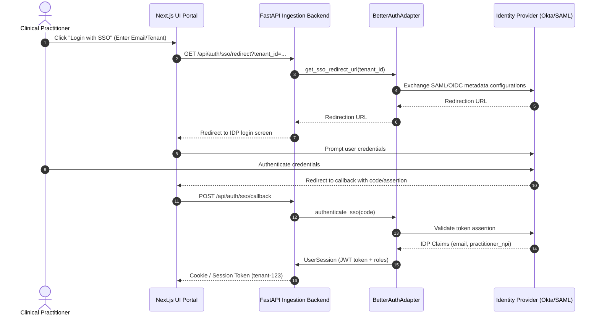
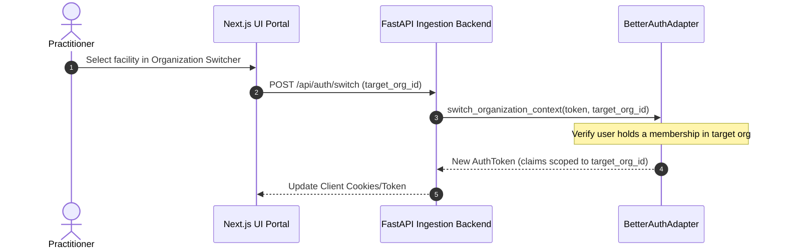
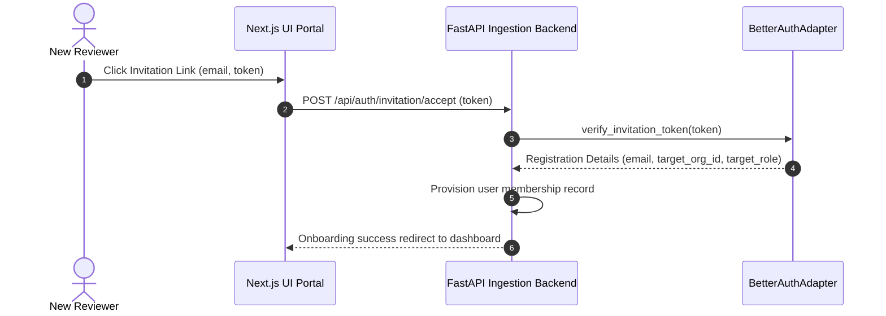

# Authentication & SSO Port Refactoring

This document defines the extensible authentication and Single Sign-On (SSO) architecture designed for the medingest multi-tenant SaaS platform.

---

## 1. Hexagonal Authentication Ports Architecture

To keep the application domain independent of concrete authentication packages (e.g. Better Auth, Auth0, Keycloak), all authentication workflows are isolated behind outbound port interfaces.

```
  ┌──────────────────┐
  │   User Interface  │ (FastAPI / Next.js)
  └────────┬─────────┘
           │
           ▼
  ┌──────────────────┐
  │    Use Cases     │ (Login, Refresh, Switch)
  └────────┬─────────┘
           │
           ▼
  ┌──────────────────┐
  │   Auth Ports     │ (IAuthenticationService, ISsoProvider, IUserProvisioningService)
  └────────┬─────────┘
           │
           ▼
  ┌──────────────────┐
  │  Auth Adapters   │ (BetterAuthAdapter, SsoAdapter, ScimAdapter)
  └──────────────────┘
```

---

## 2. Core Authentication Sequences

### 2.1 Single Sign-On (SSO) Login Flow
The following sequence diagram details user authentication via OIDC or SAML federated links:



### 2.2 Tenant/Organization Switch Flow
Users holding multiple memberships (e.g., a practitioner working across both *Main Campus* and *St. Jude Outpatient Clinic*) can switch their active context without re-authenticating:



### 2.3 Invitation Acceptance Flow
New reviewers sign up through administrative invitation links:


