# medingest Digital Fax Ingestion System: DDD Domain Model Specification

This document defines the comprehensive Domain-Driven Design (DDD) domain model for **medingest**. It identifies the business subdomains, classifies them, outlines the Bounded Context mapping, and specifies the Aggregates, Entities, Value Objects, Repositories, and Domain Events for each of the 12 business subdomains.

---

## 1. Domain Categorization

To align engineering efforts with business value, the 12 domains are categorized into **Core**, **Supporting**, and **Generic** subdomains:

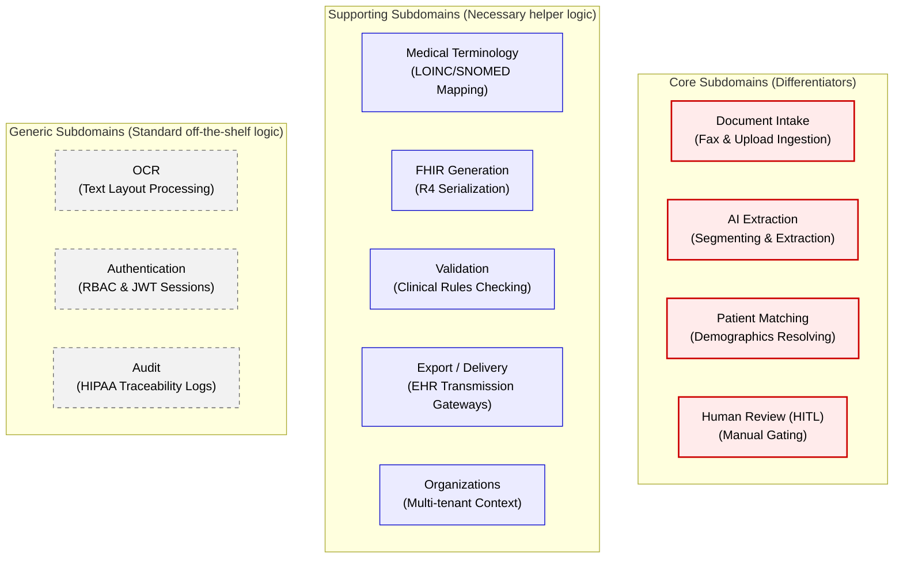

---

## 2. Bounded Context Map

The relationship and translation pathways between contexts are mapped using DDD strategic relationship patterns:

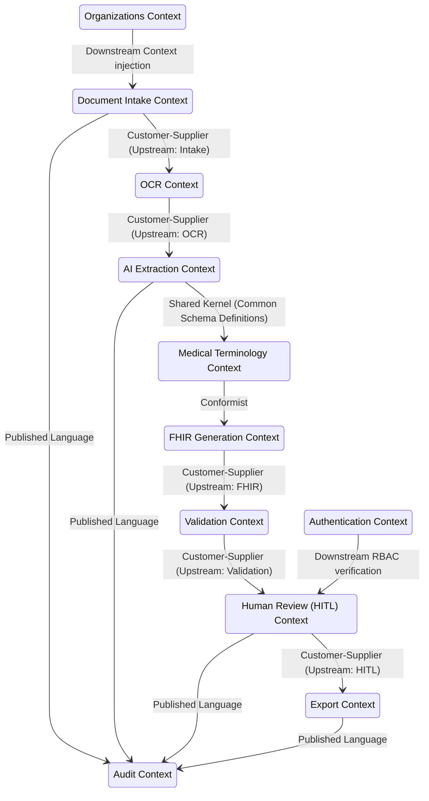

- **Shared Kernel**: The `AI Extraction` and `Medical Terminology` contexts share the base clinical Pydantic schemas (`resources.py`) to map variables in-place.
- **Customer-Supplier**: `Document Intake` supplies raw files to `OCR`. `OCR` supplies page text layouts to `AI Extraction`. `Validation` supplies failed segments to the `Human Review (HITL)` context.
- **Conformist**: `FHIR Generation` conforms directly to the domain schemas defined by `Medical Terminology` and `AI Extraction` and transforms them to standard R4 protobufs.
- **Published Language**: The `Audit` context consumes domain events published in a public language format by all contexts to record compliance logs.

---

## 3. Detailed Subdomain Specifications

### 1. Document Intake Subdomain (Core)

- **Responsibility**: Ingests raw faxes (PSTN/FoIP) and manual file uploads, performs file size/integrity checks, generates a unique `FaxId`, and writes bytes to S3 object storage.

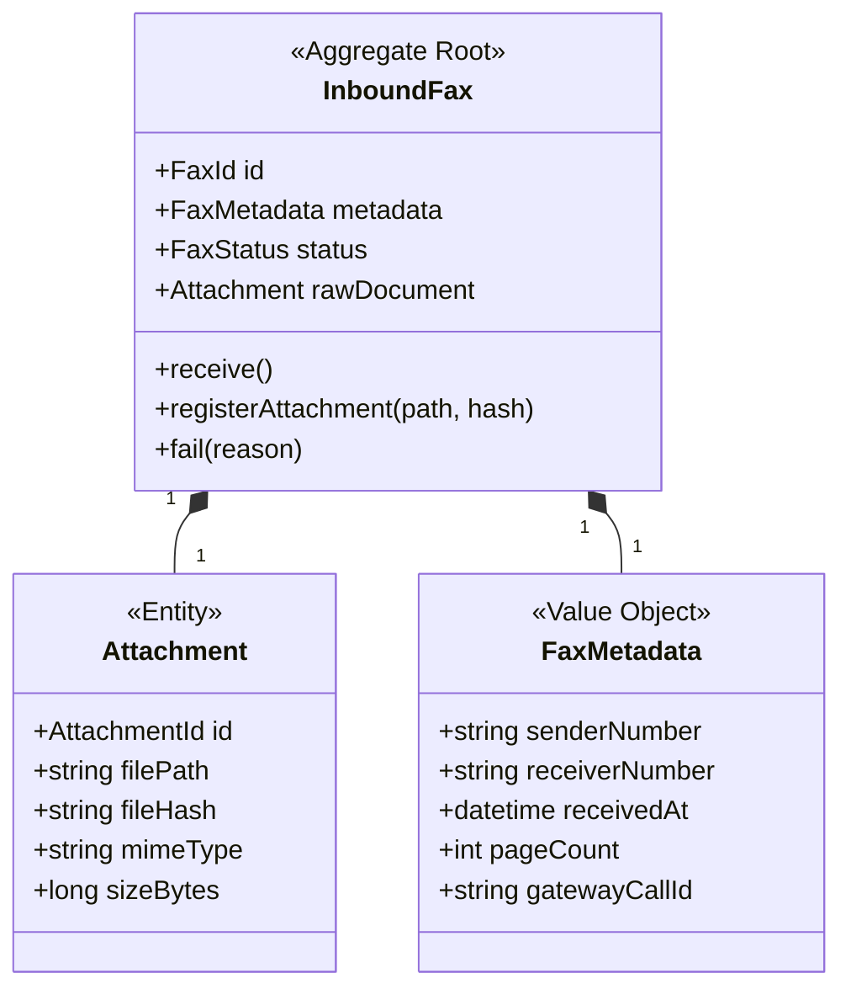

- **Domain Events**:
  - `FaxReceivedEvent`: Fired when a fax is successfully registered and written to storage.
  - `IntakeFailedEvent`: Fired if files are corrupted or page boundaries cannot be read.
- **Repository Interface**:
  ```python
  class IInboundFaxRepository(abc.ABC):
      def save(self, fax: InboundFax) -> None: ...
      def get_by_id(self, id: FaxId) -> InboundFax | None: ...
  ```

---

### 2. OCR Subdomain (Generic)

- **Responsibility**: Coordinates with OCR engines (Tesseract, Cloud Document AI, etc.) to extract raw text content, word coordinates, and structural layouts from rendered page images.

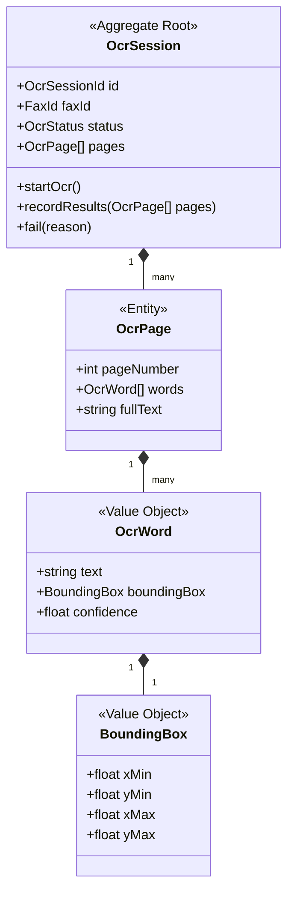

- **Domain Events**:
  - `OcrCompletedEvent`: Fired when all pages are parsed and transcribed.
  - `OcrFailedEvent`: Fired if the layout translation crashes or returns empty responses.
- **Repository Interface**:
  ```python
  class IOcrSessionRepository(abc.ABC):
      def save(self, session: OcrSession) -> None: ...
      def get_by_fax_id(self, fax_id: FaxId) -> OcrSession | None: ...
  ```

---

### 3. AI Extraction Subdomain (Core)

- **Responsibility**: Invokes LLMs to partition a multi-page document into segments, classify their document types (e.g. Lab Report vs. Prescription), and extract structured clinical fields into target Pydantic schemas.

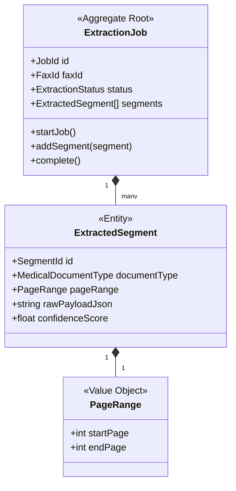

- **Domain Events**:
  - `DocumentSegmentedEvent`: Fired when document boundaries and types are classified.
  - `ExtractionCompletedEvent`: Fired when structured JSON schemas are generated.
  - `ExtractionFailedEvent`: Fired when the model returns unparseable outputs or times out.
- **Repository Interface**:
  ```python
  class IExtractionJobRepository(abc.ABC):
      def save(self, job: ExtractionJob) -> None: ...
      def get_by_id(self, id: JobId) -> ExtractionJob | None: ...
  ```

---

### 4. Patient Matching Subdomain (Core)

- **Responsibility**: Compares extracted patient demographics against the local database or an external Master Patient Index (MPI) via FHIR queries to link the fax securely to a single patient identifier.

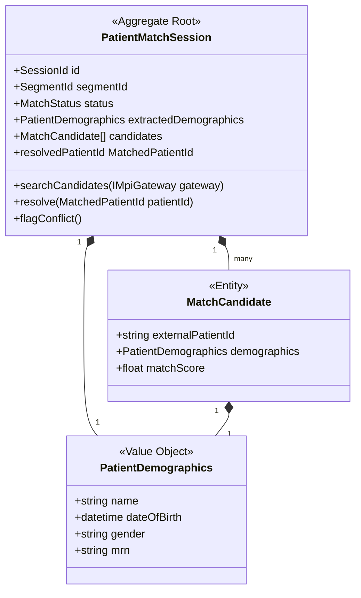

- **Domain Events**:
  - `PatientMatchedEvent`: Fired when a candidate matches above the threshold or is manually chosen.
  - `PatientMatchConflictDetectedEvent`: Fired when multiple candidates share similar scores, halting auto-ingestion.
  - `PatientNotFoundEvent`: Fired when no matching database record is resolved.
- **Repository Interface**:
  ```python
  class IPatientMatchSessionRepository(abc.ABC):
      def save(self, session: PatientMatchSession) -> None: ...
      def get_by_id(self, id: SessionId) -> PatientMatchSession | None: ...
  ```

---

### 5. Medical Terminology Subdomain (Supporting)

- **Responsibility**: Standardizes raw clinical values (analytes, units, specimens) into canonical codes (e.g. LOINC, SNOMED CT) using precomputed offline knowledge base indexes and string anagram matching.

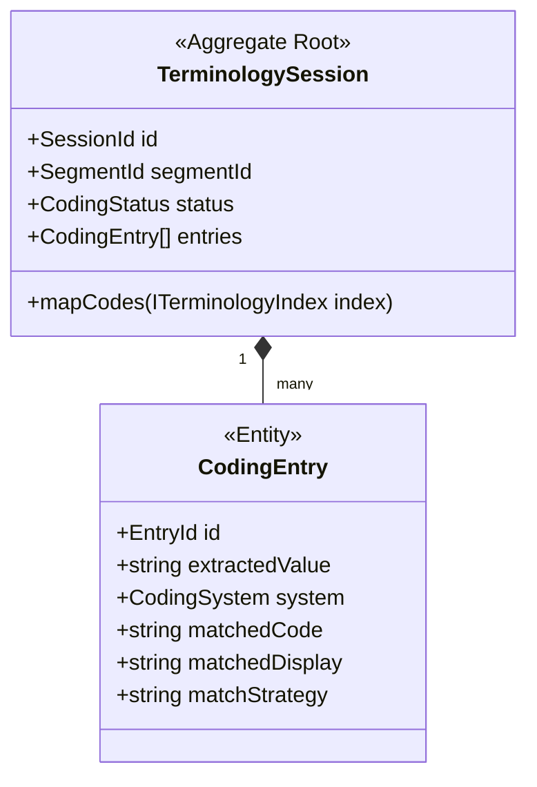

- **Domain Events**:
  - `TerminologyEnrichedEvent`: Fired when all extractable entities have standard code assignments.
  - `TerminologyResolutionFailedEvent`: Fired if critical values (like a high-risk lab analyte) cannot be resolved.
- **Repository Interface**:
  - Medical Terminology reads pre-loaded indexes (`loinc_analaytes_index_csv_path`) using read-only in-memory indices, hence a standard mutable repository is not required. Rather, it accesses an index service interface:
  ```python
  class ITerminologyIndex(abc.ABC):
      def search_analyte(self, query: str) -> list[LoincCandidate]: ...
  ```

---

### 6. FHIR Generation Subdomain (Supporting)

- **Responsibility**: Translates validated Pydantic domain models into official HL7 FHIR R4 JSON structures (such as DiagnosticReport, Observation, and DocumentReference) using strict schema specifications.

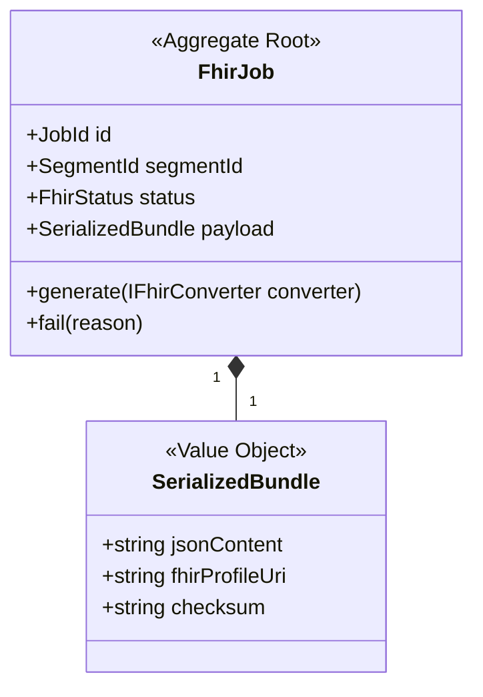

- **Domain Events**:
  - `FhirBundleGeneratedEvent`: Fired when a bundle matches profile requirements.
  - `FhirGenerationFailedEvent`: Fired if serialization errors occur.
- **Repository Interface**:
  ```python
  class IFhirJobRepository(abc.ABC):
      def save(self, job: FhirJob) -> None: ...
      def get_by_segment_id(self, segment_id: SegmentId) -> FhirJob | None: ...
  ```

---

### 7. Validation Subdomain (Supporting)

- **Responsibility**: Validates clinical safety rules (e.g., matching reference range logic, validating past dates, flagging out-of-bound values) before transmission.

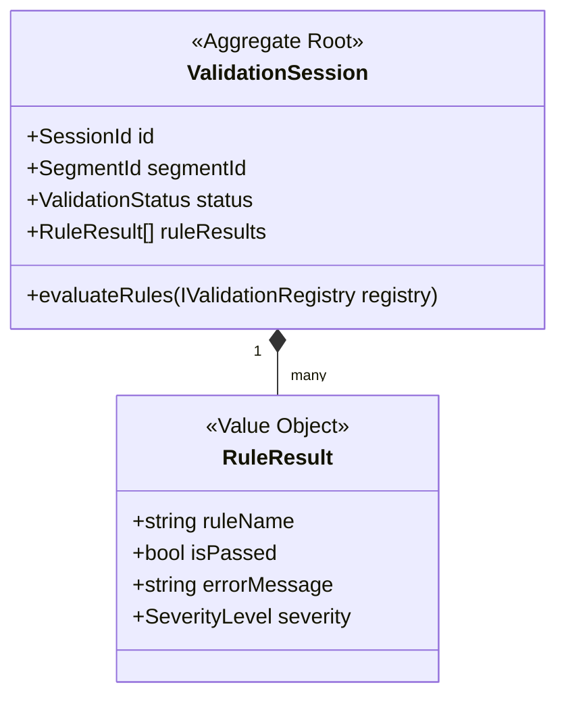

- **Domain Events**:
  - `ValidationPassedEvent`: Fired when all critical clinical constraints pass.
  - `ValidationFailedEvent`: Fired if validation rules fail, gating subsequent transmission steps.
- **Repository Interface**:
  ```python
  class IValidationSessionRepository(abc.ABC):
      def save(self, session: ValidationSession) -> None: ...
  ```

---

### 8. Human Review / HITL Subdomain (Core)

- **Responsibility**: Manages human-in-the-loop task queues for manual data correction, conflict resolutions, and handwriting transcription.

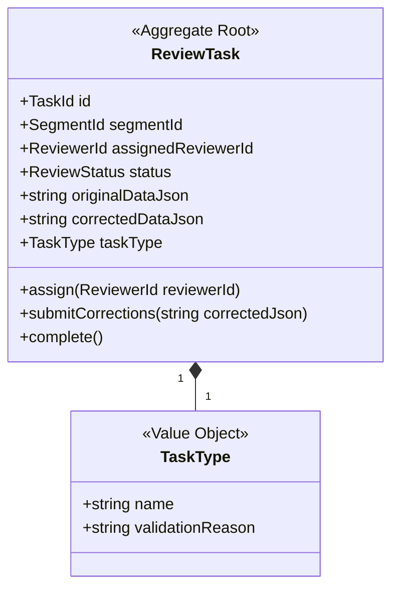

- **Domain Events**:
  - `ReviewTaskCreatedEvent`: Fired when validation or patient matching raises a manual review flag.
  - `ReviewTaskAssignedEvent`: Fired when a clinical reviewer claims the task.
  - `ReviewTaskCompletedEvent`: Fired when manual corrections are submitted and validated.
- **Repository Interface**:
  ```python
  class IReviewTaskRepository(abc.ABC):
      def save(self, task: ReviewTask) -> None: ...
      def get_by_id(self, id: TaskId) -> ReviewTask | None: ...
      def get_pending_tasks() -> list[ReviewTask]: ...
  ```

---

### 9. Export / Delivery Subdomain (Supporting)

- **Responsibility**: Handles transmitting validated FHIR bundles to external EHR destinations over secure channels (HTTPS, MLLP, SFTP), handling HTTP response parsing and retry policies.

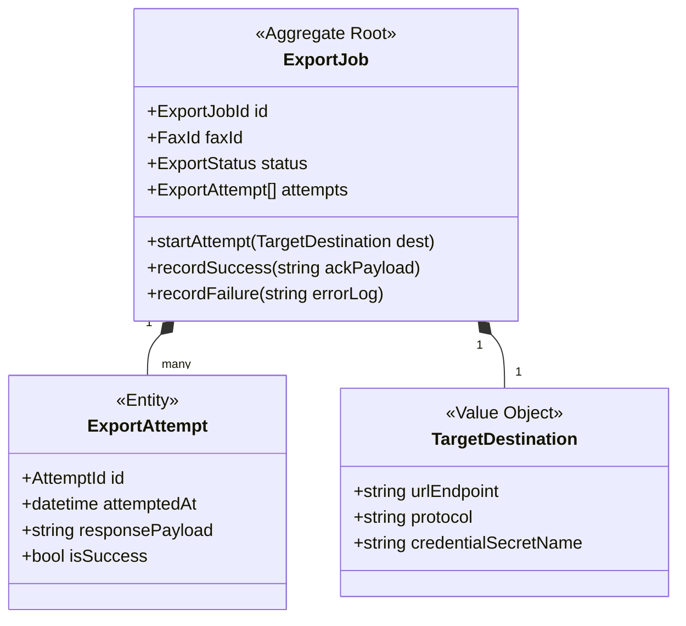

- **Domain Events**:
  - `ExportSucceededEvent`: Fired when external EHR returns positive delivery acknowledgement.
  - `ExportFailedEvent`: Fired if max retries are exceeded.
  - `ExportRetryingEvent`: Fired when transient network errors trigger a retry schedule.
- **Repository Interface**:
  ```python
  class IExportJobRepository(abc.ABC):
      def save(self, job: ExportJob) -> None: ...
      def get_by_id(self, id: ExportJobId) -> ExportJob | None: ...
  ```

---

### 10. Audit Subdomain (Generic)

- **Responsibility**: Immutable event-sourcing and audit log recorder capturing every state change, user interaction, and database mutation for HIPAA security compliance.

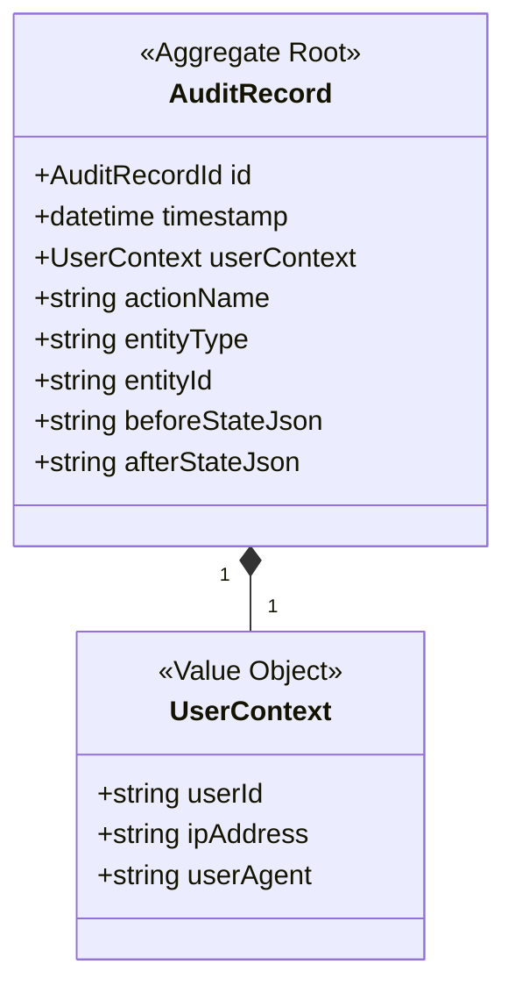

- **Domain Events**:
  - Audit is a write-only sink. It consumes events from other domains to write audit trails. It does not dispatch domain events to trigger secondary business actions.
- **Repository Interface**:
  ```python
  class IAuditRepository(abc.ABC):
      def write(self, record: AuditRecord) -> None: ...
  ```

---

### 11. Organizations Subdomain (Supporting)

- **Responsibility**: Manages clinics, physical facilities, routing targets, and tenant settings in a multi-tenant hierarchy.

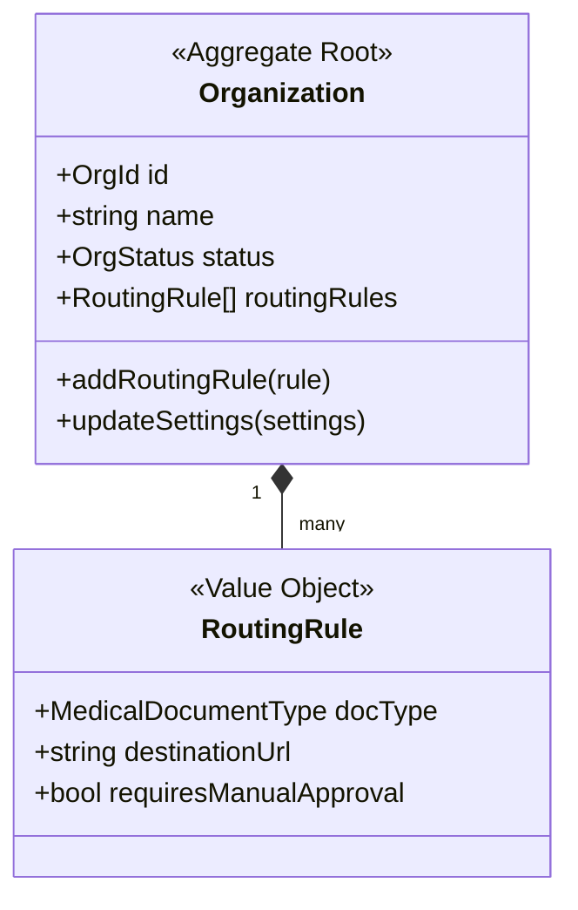

- **Domain Events**:
  - `OrganizationCreatedEvent`: Fired when a new tenant clinic is registered.
  - `OrganizationRoutingUpdatedEvent`: Fired when delivery endpoints are modified.
- **Repository Interface**:
  ```python
  class IOrganizationRepository(abc.ABC):
      def save(self, org: Organization) -> None: ...
      def get_by_id(self, id: OrgId) -> Organization | None: ...
  ```

---

### 12. Authentication Subdomain (Generic)

- **Responsibility**: Validates user logins, session tokens, JWT signatures, and provides Role-Based Access Control (RBAC) permissions.

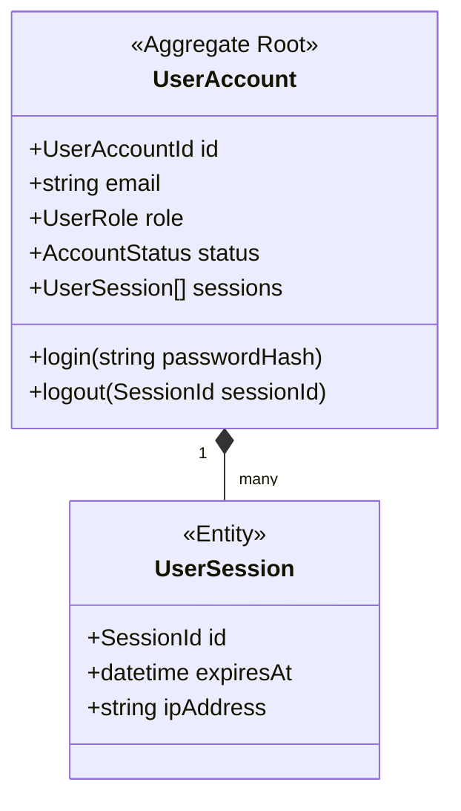

- **Domain Events**:
  - `UserAuthenticatedEvent`: Fired upon successful verification.
  - `AuthenticationFailedEvent`: Fired when login credentials reject.
- **Repository Interface**:
  ```python
  class IUserAccountRepository(abc.ABC):
      def save(self, account: UserAccount) -> None: ...
      def get_by_email(self, email: str) -> UserAccount | None: ...
  ```

---

## 4. Domain Event Choreography Flow

The diagram below traces how domain events coordinate asynchronously to transition faxes from raw receipt to EHR ingestion:

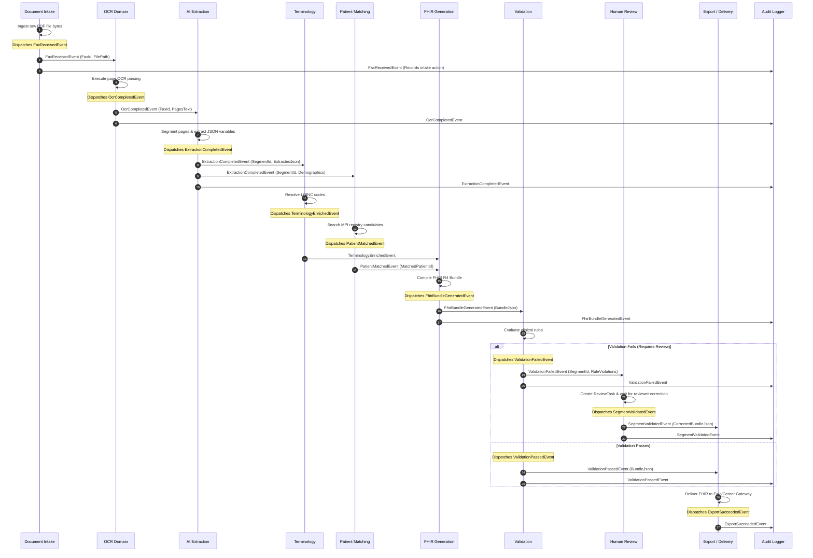

---

## 5. Code Directory Mapping

In our Clean Architecture directory structure, these domain components are organized within `src/domain/`:

```directory
src/domain/
├── common/                         # Domain building blocks
│   ├── entity.py                   # Base class with structural ID equality
│   ├── value_object.py             # Base class implementing immutability
│   └── domain_event.py             # Event structures holding occurrences timestamp
├── intake/                         # Document Intake Context
│   ├── entities.py                 # InboundFax, Attachment
│   ├── value_objects.py            # FaxMetadata
│   └── events.py                   # FaxReceivedEvent
├── ocr/                            # OCR Context
│   ├── entities.py                 # OcrSession, OcrPage
│   ├── value_objects.py            # OcrWord, BoundingBox
│   └── events.py                   # OcrCompletedEvent
├── extraction/                     # AI Extraction Context
│   ├── entities.py                 # ExtractionJob, ExtractedSegment
│   ├── value_objects.py            # PageRange
│   └── events.py                   # ExtractionCompletedEvent
├── matching/                       # Patient Matching Context
│   ├── entities.py                 # PatientMatchSession, MatchCandidate
│   ├── value_objects.py            # PatientDemographics
│   └── events.py                   # PatientMatchedEvent
├── terminology/                    # Terminology Context
│   ├── entities.py                 # TerminologySession, MappedCodeEntry
│   └── events.py                   # TerminologyEnrichedEvent
├── fhir/                           # FHIR Generation Context
│   ├── entities.py                 # FhirJob
│   ├── value_objects.py            # SerializedBundle
│   └── events.py                   # FhirBundleGeneratedEvent
├── validation/                     # Validation Context
│   ├── entities.py                 # ValidationSession
│   ├── value_objects.py            # RuleResult
│   └── events.py                   # ValidationPassedEvent
├── review/                         # Human Review Context
│   ├── entities.py                 # ReviewTask
│   ├── value_objects.py            # TaskType
│   └── events.py                   # ReviewTaskCompletedEvent
├── export/                         # Export Context
│   ├── entities.py                 # ExportJob, ExportAttempt
│   ├── value_objects.py            # TargetDestination
│   └── events.py                   # ExportSucceededEvent
├── audit/                          # Audit Context
│   ├── entities.py                 # AuditRecord (Aggregate Root)
│   └── value_objects.py            # UserContext
├── organizations/                  # Organizations Context
│   ├── entities.py                 # Organization
│   ├── value_objects.py            # RoutingRule
│   └── events.py                   # OrganizationCreatedEvent
└── auth/                           # Authentication Context
    ├── entities.py                 # UserAccount, UserSession
    └── events.py                   # UserAuthenticatedEvent
```
