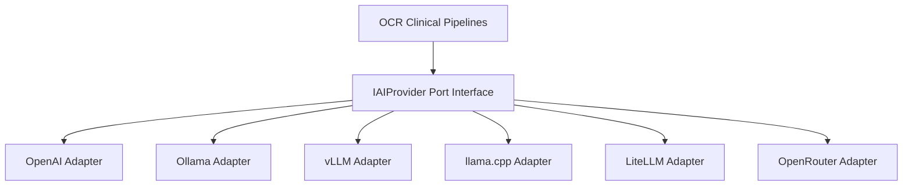

# Bounded Context: AI Provider Management

The AI Provider Management bounded context isolates model providers, endpoint configurations, fallback rules, prompt layouts, and retry limits. It isolates downstream clinical extraction pipelines from any specific LLM provider API.

---

## Architecture Design Principles

To ensure complete vendor independence, the bounded context employs the Dependency Inversion Principle (DIP):

No business logic depends on specific API client libraries. Providers are configured at runtime based on the resolved `TenantAIProviderConfiguration` aggregate parameters.

---

## Fallback Routing Strategy

When a clinical analysis is triggered:
1. The **`TenantAIRoutingService`** loads the priority list of providers (sorted ascending by `priority`).
2. It attempts text completion using the preferred model.
3. If the connection fails, it executes exponential retries guided by the tenant's **`RetryStrategy`**.
4. If the preferred provider remains unresponsive, the routing service gracefully transitions to the subsequent provider in the priority list.
5. If all configured providers fail, it executes a global check using the **`fallback_model`** via a default OpenAI fallback provider.

---

## Tactical DDD Artifacts

### 1. Value Objects
* **`ModelParameters`**: Enforces temperature (0.0 to 2.0), max tokens, and timeout bounds.
* **`RetryStrategy`**: Controls retry limits and backoff calculations.
* **`PromptTemplates`**: Holds customized prompt templates (e.g. Athena EHR classification format layouts).
* **`Thresholds`**: Manages confidence thresholds for triggers and human review requirements.
* **`ProviderConfig`**: Maps provider endpoint URLs, model codes, and routing priority indexes.

### 2. Aggregate Root
* **`TenantAIProviderConfiguration`**: Scopes settings versions, priority mappings, and validations.

### 3. Outbound Port
* **`ITenantAIProviderRepository`**: De-couples settings storage logic.

### 4. Domain Service
* **`TenantAIRoutingService`**: Orchestrates fallback routing, retry delays, and default model checks.
