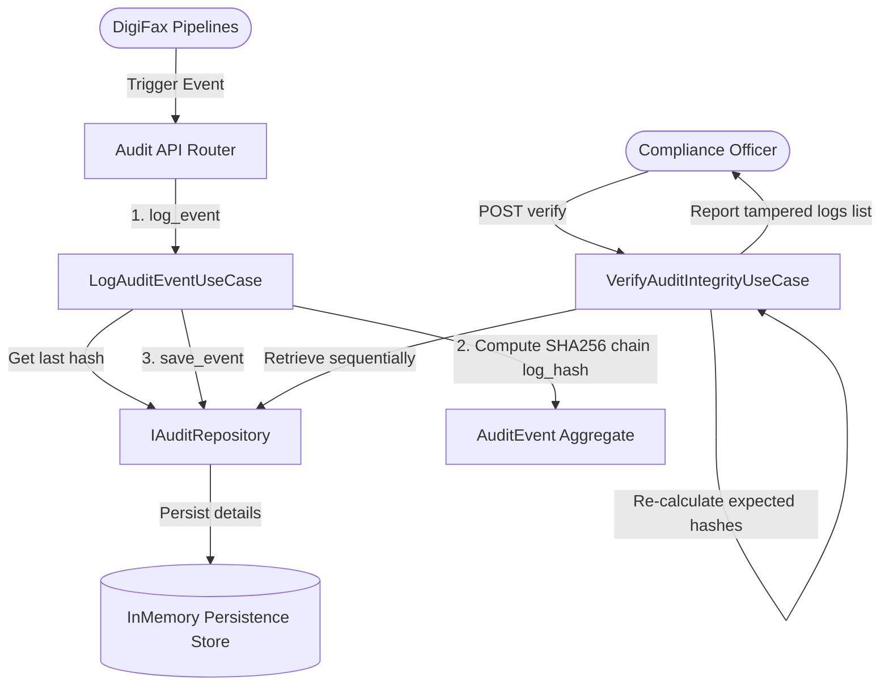

# Domain Guide: Audit, Governance, & Cryptographic Tamper Detection

The **Audit & Governance** Bounded Context logs user activities, key rotations, database adjustments, configuration changes, and intake runs. It links entries cryptographically sequentially to build a tamper-detectable chain.

---

## Log Ingestion & Tamper Scan Flow

---

## Cryptographic Hash Sequencing

For every `AuditEvent` aggregate, the `log_hash` is computed sequentially as follows:

\[H_n = \text{SHA256}(\text{EventID} \parallel \text{TenantID} \parallel \text{Timestamp} \parallel \text{UserID} \parallel \text{Payload} \parallel H_{n-1})\]

Where:
* \(H_{n-1}\) represents the hash signature of the preceding audit event entry.
* The first genesis event defaults \(H_{n-1} = \text{"GENESIS"}\).
* If any historical entry is altered, all subsequent hashes in the chain break, raising tamper alarms during integrity scans.
