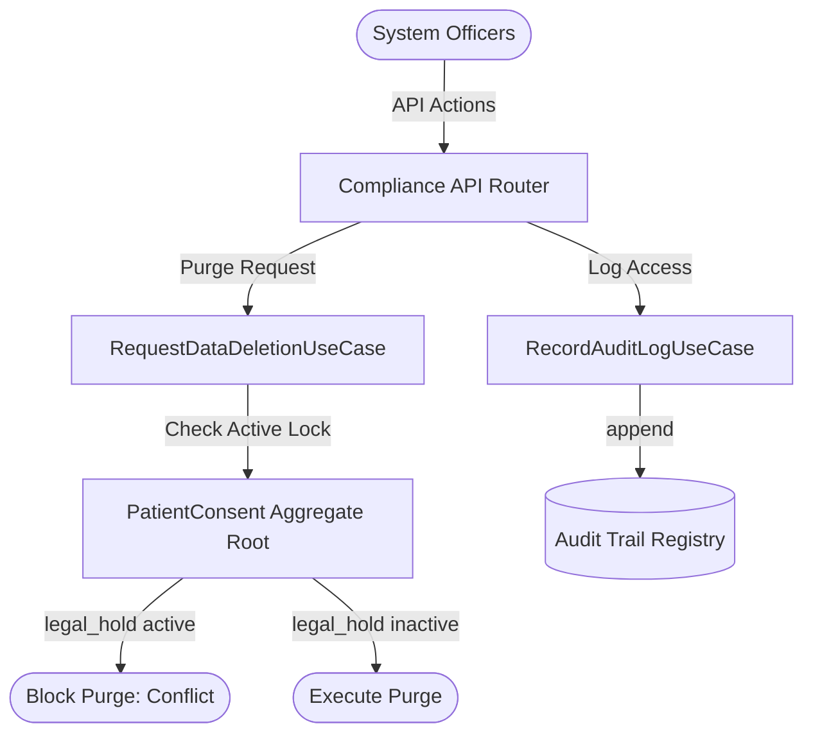
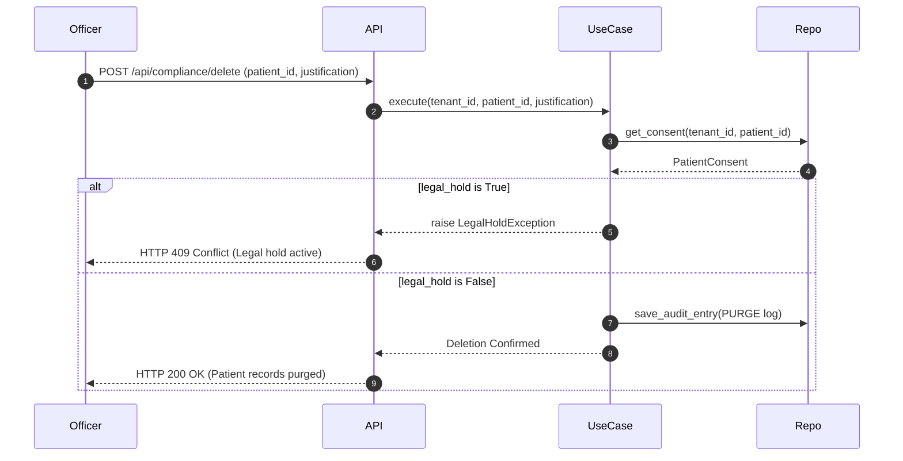

# Domain Guide: Compliance & Privacy Policies

The **Compliance** Bounded Context enforces privacy regulations (HIPAA, GDPR, PIPEDA, Australian Privacy Act), consent opt-in scopes, retention rules schedules, legal hold account locks, and immutable access audit log timelines.

---

## Context Architecture Map

---

## Domain Elements

### 1. Value Objects
* **`ComplianceRegulation`**: Details name (HIPAA, GDPR, etc.), description, and enforcement region.
* **`ConsentPolicy`**: Patient's opt-in/opt-out status, scope, and signature timestamp.
* **`RetentionRule`**: Resource retention duration (days) and expiration action (Purge or Archive).
* **`AuditLogEntry`**: Access trail auditing tracking justification, user, action, and timestamp.

### 2. Aggregate Roots
* **`TenantComplianceConfiguration`**: Manages enabled regulations and retention rules.
* **`PatientConsent`**: Holds patient consent list records and toggles `legal_hold` active flags.

---

## Right to Deletion Sequence Diagram

