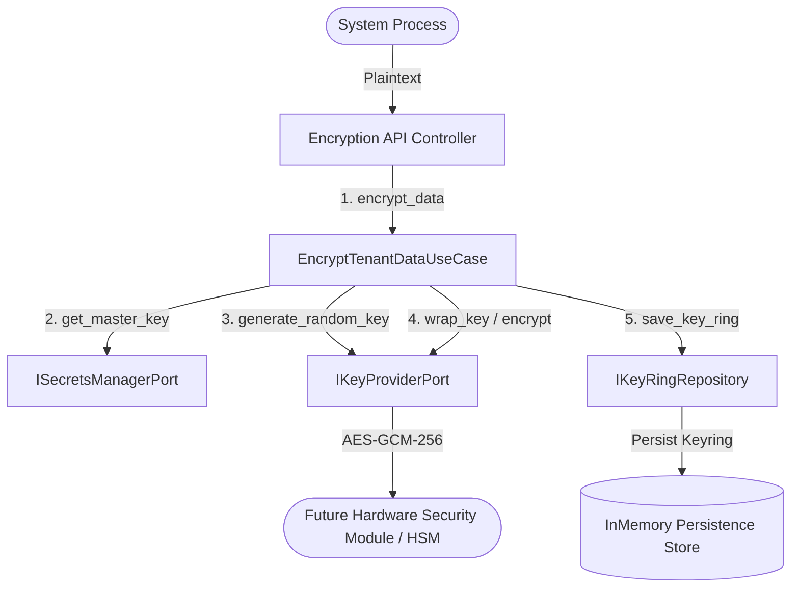
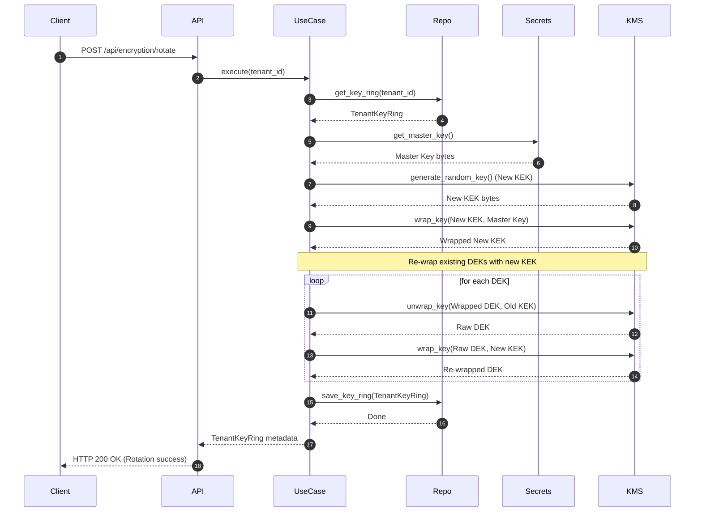

# Domain Guide: Cryptographic Encryption & Envelope Wrapping

The **Encryption** Bounded Context enforces envelope encryption at rest, tenant-scoped Key Encryption Keys (KEK), Data Encryption Keys (DEKs), key rotation workflows, and pluggable KMS/HSM keystores.

---

## Architectural Context Map

---

## Cryptographic Envelope Design

Symmetric data encryption utilizes envelope wrapping, isolating tenant data:
1. **Master Key**: Enclosed inside a secure key vault (Secrets Manager), wraps individual tenant Key Encryption Keys (KEKs).
2. **Key Encryption Key (KEK)**: Tenant-specific key stored wrapped by the system Master Key, used to wrap the tenant's active Data Encryption Key (DEK).
3. **Data Encryption Key (DEK)**: Tenant-specific key stored wrapped by the tenant's KEK, used directly to encrypt patient resources with AES-GCM-256.

---

## Key Rotation Sequence Diagram

