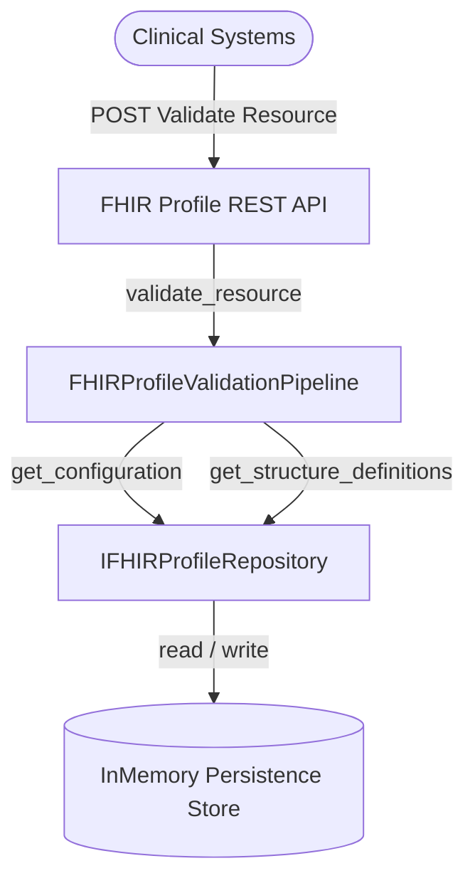
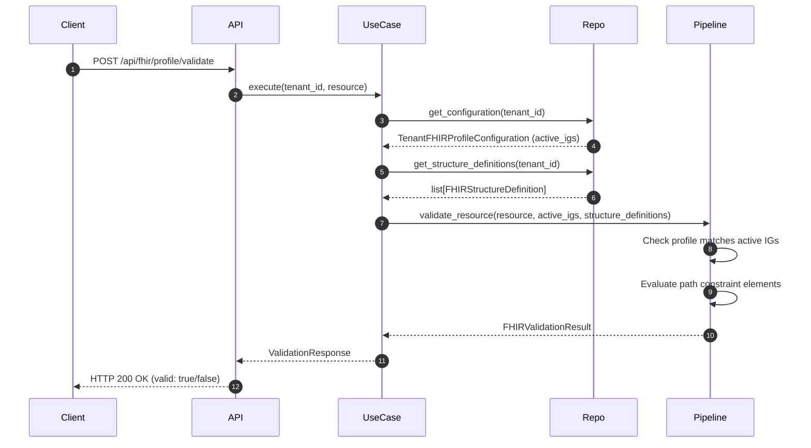

# Domain Guide: FHIR Profile Management

The **FHIR Profile Management** Bounded Context enables tenants to select active standard FHIR Implementation Guides (such as US Core and International Patient Summary) and upload custom profiles (`StructureDefinition` resources) to run validation pipelines over resource JSON payloads.

---

## Architecture Context Map

---

## Domain Elements

### 1. Value Objects
* **`FHIRImplementationGuide`**: Represents an enabled Implementation Guide, defining the name, canonical URI, and version identifier.
* **`FHIRValidationResult`**: The result structure containing a boolean conformity status, list of errors/warnings, and the validated profile URL.

### 2. Entities & Aggregate Roots
* **`TenantFHIRProfileConfiguration` (Aggregate Root)**: Tracks tenant settings and active IGs.
* **`FHIRStructureDefinition`**: Represents a profile constraint set mapped to a FHIR resource type containing nested validation paths.

---

## Validation Sequence Diagram

