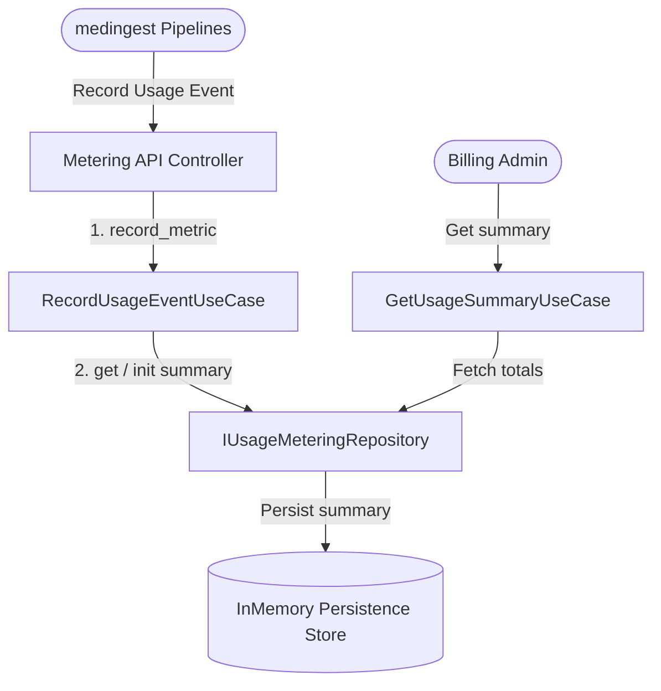

# Domain Guide: Usage Metering & Billing Audits

The **Usage Metering** Bounded Context tracks tenant transactions during active subscription cycles. It supports documents uploads, page counts, OCR processing, LLM/AI tokens, validation checks, exports, and storage/bandwidth metrics.

---

## Architectural Context Map

---

## Tracked Billing metrics

The domain model scopes the following system transactions:
1. **`DOCUMENTS_UPLOADED`**: Accrues total inbound clinical fax document count.
2. **`PAGES_PROCESSED`**: Accrues total pages processed across intake pipelines.
3. **`OCR_REQUESTS`**: Accrues total calls made to OCR extraction servers (e.g. DocTR, Surya).
4. **`AI_REQUESTS`**: Accrues total calls made to Ollama, OpenAI, or LiteLLM endpoints.
5. **`FHIR_RESOURCES`**: Accrues total FHIR resources mapped and generated.
6. **`VALIDATION_REQUESTS`**: Tracks profile schema validation pipelines runs.
7. **`EXPORTS`**: Tracks data exports (Right to Export runs).
8. **`STORAGE_BYTES`**: Monitors active total files storage size.
9. **`BANDWIDTH_BYTES`**: Monitors inbound/outbound transfer bytes sizes.
10. **`USERS_COUNT`**: Tracks total active tenant users count.
11. **`API_CALLS`**: Records REST endpoint calls count.
12. **`WORKFLOW_EXECUTIONS`**: Records workflow automation pipelines runs.
13. **`REVIEW_SESSIONS`**: Tracks manual review logs.
