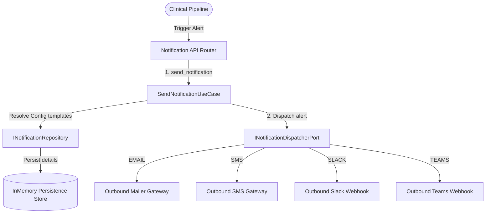

# Domain Guide: Notification Dispatcher & Retries

The **Notification** Bounded Context maps template placeholders, injects tenant-specific branding rules, and dispatches clinical notifications over Email, SMS, Webhooks, Slack, and Microsoft Teams.

---

## Inbound/Outbound Context Architecture

---

## Core Domain Elements

### 1. Value Objects
* **`NotificationTemplate`**: Stores reusable templates for subjects and body texts.
* **`EscalationRule`**: Declares alternative channels and backup recipients if main pathways fail.
* **`DeliveryLog`**: Stores status tracks, error logs, and retry iterations.

### 2. Aggregate Roots
* **`TenantNotificationConfig`**: Tracks customized branding guidelines (headers, footers) and template key-value tables.
* **`NotificationRequest`**: Orchestrates dispatch tasks, retries, and escalations.
