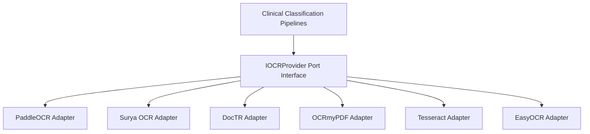

# Bounded Context: OCR Provider Management

The OCR Provider Management bounded context isolates document text parser engines, pre-processing filters, layout segmentations, and language packs.

---

## Architecture Design Principles

To ensure complete engine independence, the bounded context employs the Dependency Inversion Principle (DIP):

No business logic depends on specific binary libraries or packages. Providers are configured at runtime based on the resolved `TenantOCRConfiguration` aggregate parameters.

---

## Fallback Routing Strategy

When a document extraction is triggered:
1. The **`TenantOCRRoutingService`** loads the priority list of providers (sorted ascending by `priority`).
2. It attempts text parsing using the preferred provider.
3. If the execution fails, it transitions to the next prioritized choices.
4. **Confidence Safety Gate**: If the engine completes but the confidence score falls below `confidence_threshold`, the service loops to subsequent engines to discover if another provider yields cleaner output.

---

## Tactical DDD Artifacts

### 1. Value Objects
* **`ImagePreprocessing`**: Manages deskew, rotate, binarize, and contrast enhancement configurations.
* **`ExtractionFeatures`**: Controls table layout analysis, handwriting detections, and barcode/QR extraction.
* **`OCRThresholds`**: Manages confidence thresholds for triggers.
* **`OCRProviderConfig`**: Maps provider codes, priority indexes, and active language pack listings.

### 2. Aggregate Root
* **`TenantOCRConfiguration`**: Scopes settings versions, configurations, and validations.

### 3. Outbound Port
* **`ITenantOCRRepository`**: De-couples settings storage logic.

### 4. Domain Service
* **`TenantOCRRoutingService`**: Orchestrates fallback routing and confidence threshold checking.
