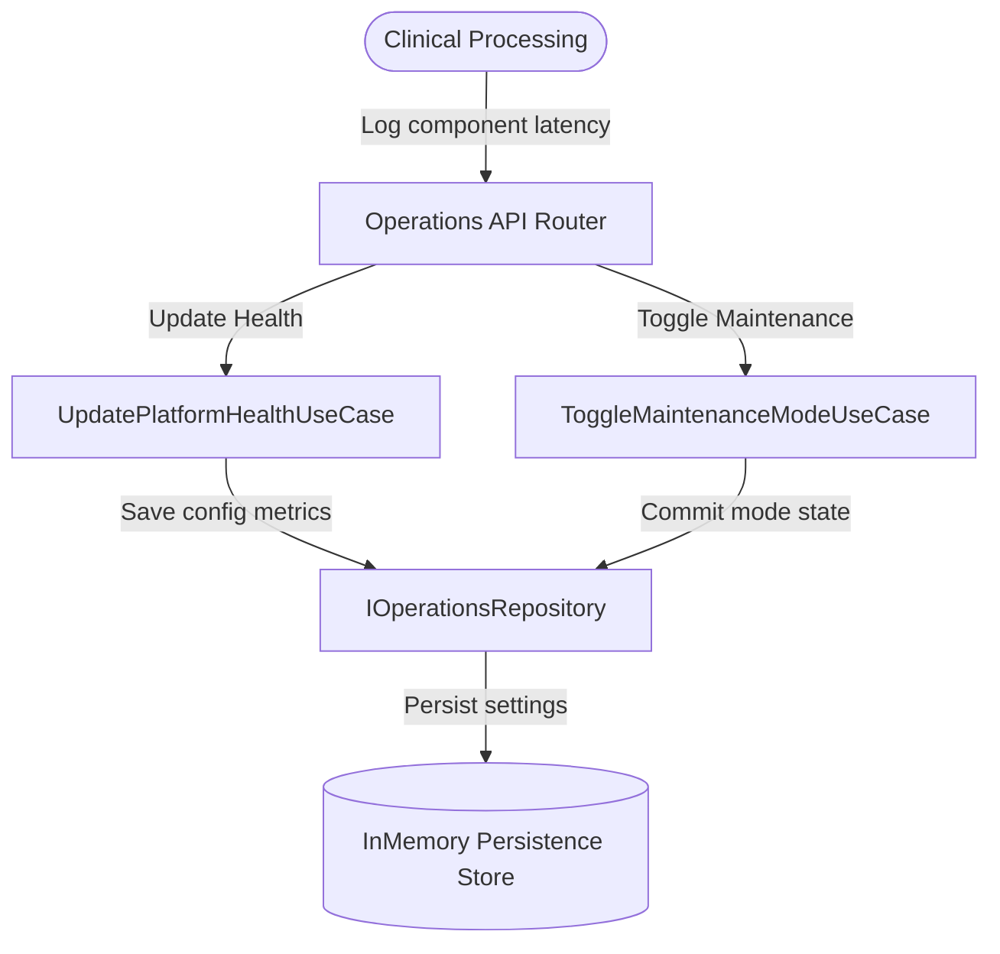

# Domain Guide: Platform Operations & System Runbooks

The **Platform Operations** Bounded Context handles global locks (Maintenance Mode), feature toggles, and aggregates latency metrics from Database, Storage, Temporal queues, and external AI/OCR extraction endpoints.

---

## Operations Architecture

---

## Operational Runbooks

### 1. Incident Response: Database / Ingest Failures
* **Symptom**: Database health status degrades or reports `latency > 1000ms`.
* **Action**:
  1. Toggle system-wide **Maintenance Mode** immediately using `POST /api/operations/maintenance {"enabled": true}`. This locks intake pipelines, queueing inbound clinical faxes.
  2. Inspect DB logs. If locked by threads, clean transactions.
  3. Once resolved, toggle maintenance mode to `false`.

### 2. Feature Deployment
* **Toggles**: Use feature flags to selectively hot-swap processing components without downtime:
  * `AUTO_INGEST`: Activates clinical faxes auto-ingestion routes.
  * `LLM_VALIDATION`: Routes extracted codes to LLM verification agents.
