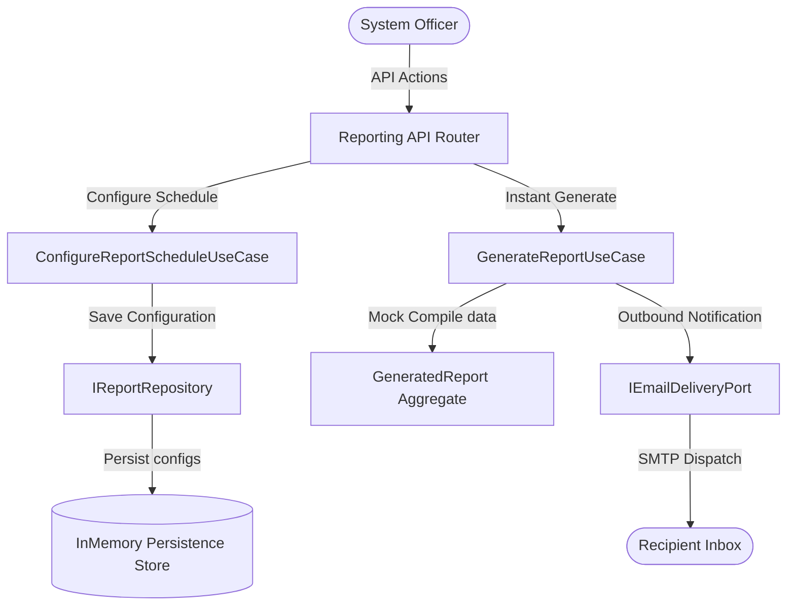

# Domain Guide: Clinical Reporting & Delivery Abstractions

The **Reporting** Bounded Context schedules and generates downloadable CSV, Excel, and PDF reports tracking OCR accuracy, AI extraction metrics, FHIR profile validations, reviewer velocity, and compliance statuses.

---

## Context Architecture Map

---

## Core Domain Elements

### 1. Value Objects
* **`ReportSchedule`**: Scopes cron expressions, target recipient emails, and delivery file formats (CSV, EXCEL, PDF).

### 2. Aggregate Roots
* **`ReportConfiguration`**: Declares report parameters, types (OCR_ACCURACY, FHIR_VALIDATION, etc.), and schedule records.
* **`GeneratedReport`**: Contains generated file URLs, compilation date, and compiled key-value data summaries.
