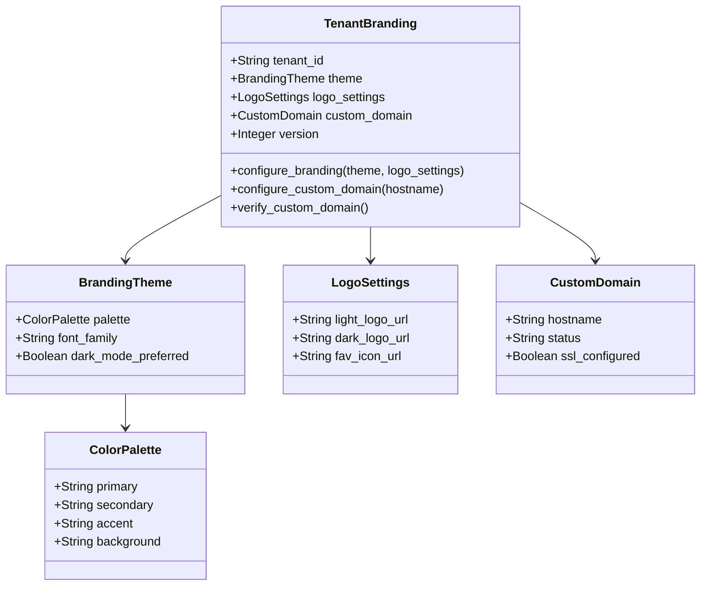
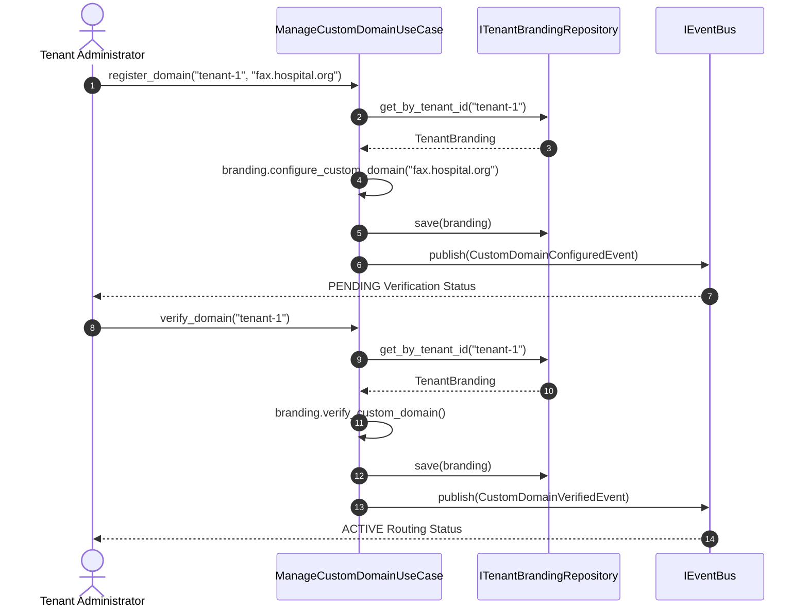

# Domain Design: Tenant Branding Bounded Context

This document defines the Tenant Branding bounded context, enabling multi-tenant visual customizability and routing.

---

## 1. Context & Business Logic

Clinical enterprise subscribers require personalized branding to ensure that practitioner operations align with local network guidelines. The Tenant Branding context decouples branding styles and subdomain routing parameters from core system logic.

---

## 2. Tactical DDD Components

### Aggregate Roots & Entities
* **`TenantBranding` [Aggregate Root]**: Isolates branding styles, custom domains, and styling version controls at the tenant level.

### Value Objects (Immutable)
* **`ColorPalette`**: Primary, secondary, accent, and background colors validated as hexadecimal codes.
* **`BrandingTheme`**: Groups the ColorPalette, custom font family, and dark mode configuration properties.
* **`LogoSettings`**: Image asset URLs for light/dark headers and browser favicons.
* **`CustomDomain`**: Handles vanity DNS domain mappings (`fax.hospital.org`) and TLS certificate states (`PENDING`, `ACTIVE`, `FAILED`).

### Domain Events
* **`BrandingUpdatedEvent`**: Dispatched when theme colors or logos are modified.
* **`CustomDomainConfiguredEvent`**: Triggered when a new domain routing key is registered.
* **`CustomDomainVerifiedEvent`**: Triggered when custom domain DNS validation checks pass.

---

## 3. Operations & Sequence Flow

### Custom Domain Registration & Verification

---

## 4. Key Design Decisions

1. **Validation Boundaries**: Hexadecimal codes are asserted upon value object creation inside `ColorPalette` to prevent front-end styling injection risks.
2. **Sequential Registration**: Subdomains are locked in `PENDING` states upon registration, preventing live routing bindings until DNS ownership verification events complete.
3. **Optimistic Concurrency**: Any modifications to the `TenantBranding` aggregate check the `version` field in the database (`BaseInMemoryRepository`) to prevent concurrent overwrite conflicts.
