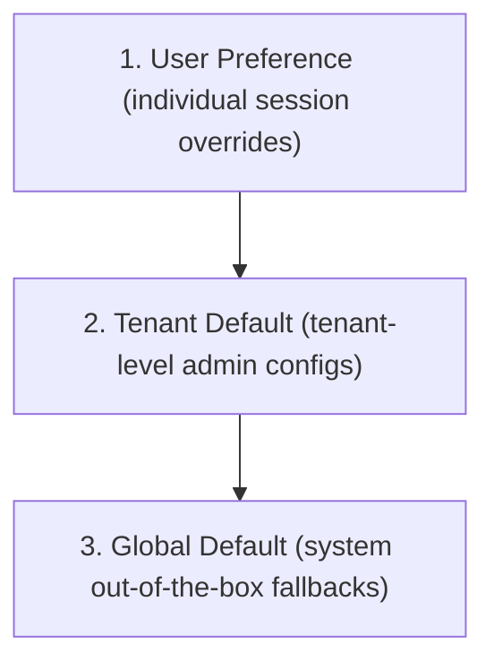

# Bounded Context: Tenant Configuration

The Tenant Configuration bounded context manages multi-tenant layout customization configurations, format presets, timezone properties, document numbering schemas, and storage retention lifecycles.

---

## Configuration Hierarchy Resolution

Settings are evaluated using a hierarchical resolution tree:



1. **User Preference**: Specific formatting settings (e.g. locale, individual timezone selection) active during user sessions, overriding tenant settings.
2. **Tenant Default**: Customized layouts, date/time layouts, clinical prefix rules, and retention limits configured by tenant administrators.
3. **Global Default**: System-wide configuration backups serving requests when a tenant profile contains unconfigured settings.

---

## Tactical DDD Artifacts

### 1. Value Objects
* **`LocaleSettings`**: Manages date, time, timezone, language, currency, number formats, and locale mappings.
* **`ClinicalFormats`**: Captures regular expressions validating Patient IDs, MRNs, and Document IDs.
* **`RetentionSettings`**: Stores default document storage retention thresholds (days).

### 2. Aggregate Root
* **`TenantConfiguration`**: Scopes setting properties, OCC versions, and triggers setting update validations.

### 3. Domain Events
* **`TenantConfigurationUpdatedEvent`**: Published when configuration attributes change.

### 4. Domain Services
* **`ClinicalNumberingService`**: Validates specific strings against regex formatting templates.

---

## API Router Interface

### 1. Retrieve Active Configurations
* **Endpoint**: `GET /api/tenant/config`
* **Headers**: `X-Tenant-ID: <tenant_id>`
* **Authorization**: `document:read` permission.
* **Response**: Scoped settings payload with fallback defaults if unconfigured.

### 2. Update Configuration Settings
* **Endpoint**: `POST /api/tenant/config`
* **Headers**: `X-Tenant-ID: <tenant_id>`
* **Authorization**: `document:write` permission.
* **Request Payload**:
  ```json
  {
    "date_format": "YYYY-MM-DD",
    "time_format": "HH:mm:ss",
    "timezone": "America/New_York",
    "language": "en",
    "currency": "USD",
    "locale": "en-US",
    "number_format": "1,234.56",
    "patient_id_format": "PAT-\\d{6}",
    "medical_record_format": "MRN-\\d{8}",
    "document_number_format": "DOC-\\d{10}",
    "default_retention_days": 365
  }
  ```
