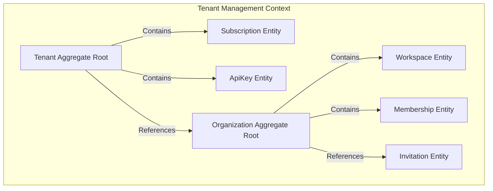
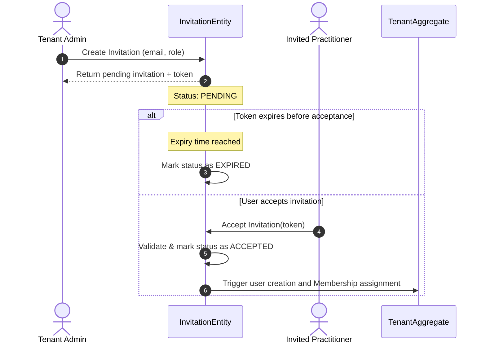

# Bounded Context Specification: Tenant Management

This document defines the domain model design, boundaries, relationships, and lifecycle transitions for the **Tenant Management** bounded context inside medingest.

---

## 1. Domain Map & Aggregate Boundaries

---

## 2. Core Domain Elements

### 2.1 Tenant (Aggregate Root)
The primary entry point representing a customer hospital system or clinical network.
* **Responsibilities**: Manages billing subscriptions, API authentication credentials, and general account lifecycle states.
* **States**: `ACTIVE`, `SUSPENDED`, `ARCHIVED`.

### 2.2 Organization (Aggregate Root / Entity)
Represents a physical healthcare site, clinic, or hospital facility belonging to a Tenant.
* **Responsibilities**: Groups operational departments, local practitioner memberships, and regional compliance configurations.

### 2.3 Workspace (Entity)
A focused clinical operational queue (e.g., "Main Emergency Desk") inside an Organization.
* **Responsibilities**: Targets specific document uploads, houses document extraction rules, and handles exports to target EHR nodes.

### 2.4 Membership (Entity)
Represents a user's association with a specific Organization inside a Tenant.
* **Responsibilities**: Links user ID to operational authorization roles.

### 2.5 Invitation (Entity)
Tracks user registration invitations sent by administrators.
* **Responsibilities**: Manages secure verification tokens, expirations, and status lifecycles (`PENDING`, `ACCEPTED`, `EXPIRED`).

### 2.6 Role (Value Object)
Defines a set of security authorization categories (e.g. `CLINICAL_REVIEWER`, `TENANT_ADMIN`).
* **Responsibilities**: Groups multiple logical permissions.

### 2.7 Permission (Value Object)
The granular authorization capability (e.g., `document:read`, `settings:write`).

### 2.8 Subscription (Entity)
Represents a tenant's billing service contract.
* **Responsibilities**: Links billing plans, billing intervals, and limits checking.

### 2.9 Billing Plan (Value Object)
Defines tier configurations (e.g., "Enterprise Ingestion Tier" allowing 10k faxes per month).

### 2.10 API Key (Entity)
Cryptographically signed access token credentials for automated integrations.
* **Responsibilities**: Handles key hashing, labeling, permissions, and expiration checks.

### 2.11 Audit Policy (Value Object)
Defines rules for compliance audit trails (e.g., "log all metadata updates for PHI reviews").

### 2.12 Retention Policy (Value Object)
Defines storage durations (e.g. "archive raw files to S3 Glacier after 90 days, hard-delete after 7 years").

---

## 3. Core Lifecycle Workflows

### 3.1 Invitation Lifecycle

