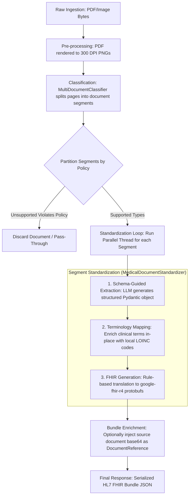
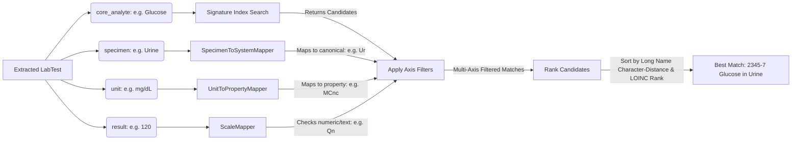
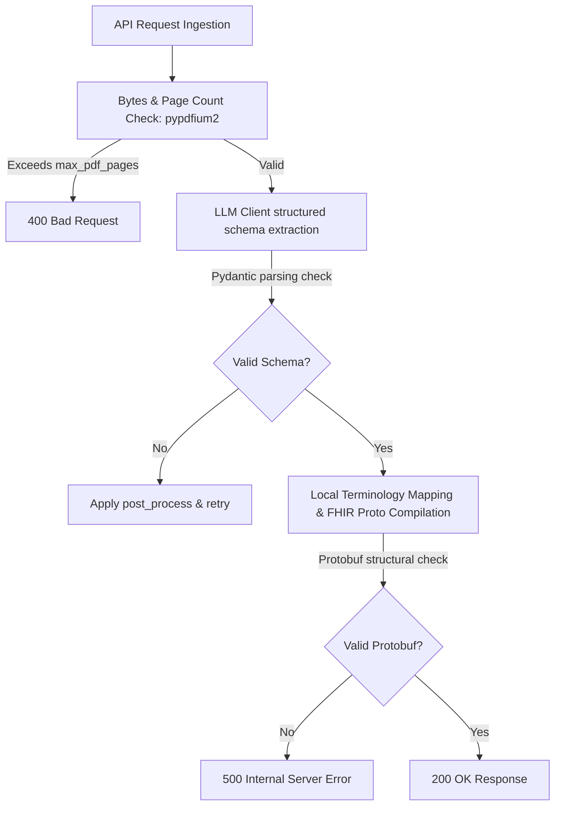
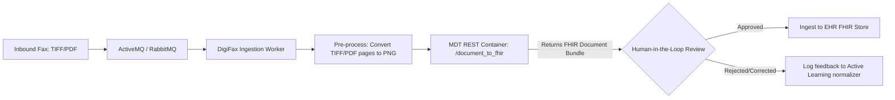

# Google Health Medical Data Toolkit: Architecture Analysis

This document provides a comprehensive architectural and engineering analysis of the **Google Health Medical Data Toolkit** (MDT), cloned from [Google-Health/medical-data-toolkit](https://github.com/Google-Health/medical-data-toolkit). This analysis outlines the repository's directory layout, pipeline orchestration flow, reusable modules, terminology services, FHIR generation processes, validation mechanisms, extension points, and recommended integration patterns for **DigiFax**.

---

## 1. Directory Structure

Below is the directory structure of the Medical Data Toolkit repository:

```directory
medical-data-toolkit/
├── Dockerfile                      # Builds container with all runtime dependencies
├── LICENSE                         # Apache 2.0 license
├── README.md                       # High-level overview and setup guide
├── nginx.conf                      # Ingress/reverse proxy configuration
├── requirements.in                 # Abstract Python dependencies (Pydantic, GenAI, FHIR)
├── requirements.txt                # Fully pinned lockfile for reproducibility
├── start_server.sh                 # Docker container startup script
├── third_party_ip_notices.md       # Compliance and copyright attributions
└── src/                            # Source code root
    ├── __init__.py                 # Package initializer
    ├── config.yaml                 # Core server config (LLMs, policies, CSV paths)
    ├── rest_server.py              # Flask/Gunicorn API server exposing endpoints
    ├── rest_server_test.py         # Integration and unit tests for API endpoints
    └── document_to_fhir/           # Core library package
        ├── __init__.py
        ├── common/                 # Reusable utility modules and schemas
        │   ├── __init__.py
        │   ├── llm_util.py         # JSON parsing and extraction helpers for LLM raw texts
        │   ├── model_client.py     # LLM Client wrapper (Gemini, Gemma, LiteLLM)
        │   ├── model_client_test.py
        │   ├── pdf_util.py         # PDF page rendering using PyPDFium2 and PIL
        │   ├── pdf_util_test.py
        │   └── schema/             # Structured Pydantic schemas (excl. default keys)
        │       ├── __init__.py
        │       ├── document_types.py # Enums for document classification & policies
        │       ├── medical_documents.py # Base document definitions (e.g. LabReport)
        │       ├── resources.py    # Common resources (Patient, Organization, LabTest)
        │       ├── standardized_composite_medical_document.py # Internal page-segment representations
        │       ├── standardized_composite_medical_document_test.py
        │       └── abdm/           # India-specific ABDM healthcare profile schemas
        │           ├── __init__.py
        │           ├── abdm_medical_documents.py
        │           └── abdm_resources.py
        └── core/                   # Core business logic and pipelines
            ├── __init__.py
            ├── classification/     # Document classification & pagination logic
            │   ├── __init__.py
            │   ├── classifier.py   # MultiDocumentClassifier wrapper for segmenting documents
            │   ├── classifier_test.py
            │   └── suggested_prompts/
            │       └── composite_document_classification.jinja2 # Classifier system prompt
            ├── extraction/         # Structured extraction logic
            │   ├── __init__.py
            │   ├── medical_extractor.py # Base class for schema-guided extraction
            │   ├── extractors/
            │   │   ├── __init__.py
            │   │   └── lab_report_extractor.py # Extractor specialized for laboratory reports
            │   └── suggested_prompts/
            │       ├── __init__.py
            │       └── lab_report.jinja2 # Extractor guidance prompt
            ├── fhir/               # Deterministic FHIR R4 translation
            │   ├── __init__.py
            │   ├── fhir_generator.py # Abstract base interface for FHIR converters
            │   ├── fhir_test_utils.py
            │   ├── fhir_utils.py   # Conversion helpers for names, dates, addresses
            │   └── abdm/           # ABDM Profile mappings (India NDHM)
            │       ├── __init__.py
            │       ├── abdm_bundle_enricher.py # Adds raw document source reference to FHIR bundles
            │       ├── abdm_bundle_enricher_test.py
            │       ├── abdm_fhir_resource_converter.py # Generates individual FHIR resources (Patient, Obs)
            │       ├── abdm_fhir_resource_converter_test.py
            │       ├── abdm_lab_report_fhir_generator.py # Assembles DiagnosticReport document bundle
            │       ├── abdm_lab_report_fhir_generator_test.py
            │       └── data/       # Example JSON documents and FHIR outputs
            │           └── lab_report/
            │               ├── lab_report_1_json_and_fhir_example.json
            │               └── lab_report_2_json_and_fhir_example.json
            └── medical_coding/     # Offline clinical terminology service mapping
                ├── __init__.py
                ├── loinc/          # Local LOINC code mapping system
                │   ├── README.md   # Architectural documentation for LOINC module
                │   ├── config.py   # CSV column definitions
                │   ├── query.py    # Runtime query engine with soft-filtering logic
                │   ├── query_test.py
                │   ├── requirements.txt # Axis builder dependencies
                │   └── axes_kb/    # Ontological builders and index files
                │       ├── core_analyte/ # Analyte normalization & signature matching
                │       │   ├── builder.py
                │       │   ├── builder_main.py
                │       │   ├── index.py # Analyte index containing hash signatures
                │       │   ├── normalize.py # Rules/Active Learning for clinical synonyms
                │       │   └── prompt.py
                │       ├── property/ # Inferred measurement properties from unit matches
                │       │   ├── builder.py
                │       │   ├── builder_main.py
                │       │   └── mapper.py
                │       ├── scale_type/ # Inferred measurement scale (Qn, Ord, Nom, Nar)
                │       │   └── mapper.py
                │       └── system/ # Inferred specimen system (e.g. Serum, Urine)
                │           ├── builder.py
                │           ├── builder_main.py
                │           ├── mapper.py
                │           └── prompt.py
                └── mapper/         # Base interfaces for clinical coding
                    ├── __init__.py
                    ├── terminology_mapper.py # Abstract ITerminologyMapper interface
                    └── terminology_mappers/
                        ├── __init__.py
                        └── loinc_terminology_mapper.py # Maps LabTests to LOINC codes in-place
```

---

## 2. Pipeline Orchestration Flow

When a client POSTs a medical document (PDF or image) to `/document_to_fhir`, the system executes a multi-step orchestration pipeline managed by [CompositeDocumentStandardizer](file:///d:/Kalyan/DigiFax/medical-data-toolkit/src/document_to_fhir/core/orchestrator/composite_document_standardizer.py):



1. **Ingest & Pre-process**: The server validates the file bytes, detects the mime type (`application/pdf`, `image/png`, or `image/jpeg`), and converts PDF pages to 300 DPI PNG images using `pdf_util` (backed by a thread-safe lock around PDFium).
2. **Document Classification**: The `MultiDocumentClassifier` uses a vision-capable LLM and a Jinja2 template ([composite_document_classification.jinja2](file:///d:/Kalyan/DigiFax/medical-data-toolkit/src/document_to_fhir/core/classification/suggested_prompts/composite_document_classification.jinja2)) to analyze the document. It detects where records split and classifies page ranges (e.g., Pages 1-2: `LABORATORY_REPORT`, Page 3: `PRESCRIPTION`).
3. **Partitioning Policy**: Segments are partitioned based on `document_standardization_policy` (e.g., `ACCEPT_ALL`, `ALLOW_ONLY_SUPPORTED`). Supported segments proceed; unsupported ones are filtered or passed through.
4. **Parallel Segment Standardization**: The standardizer spawns parallel worker threads to process each document segment through three phases:
   - **Extraction**: The segment images are sent to the LLM along with the document type's schema (e.g., `AbdmLabReport` Pydantic model) and a prompt ([lab_report.jinja2](file:///d:/Kalyan/DigiFax/medical-data-toolkit/src/document_to_fhir/core/extraction/suggested_prompts/lab_report.jinja2)) to extract a structured JSON representation of patient details, providers, and test measurements.
   - **Terminology Mapping**: The system walks the Pydantic tree recursively, finding `LabTest` objects. It queries a local, pre-computed LOINC knowledge base to resolve and inject the correct LOINC codes in-place.
   - **FHIR Generation**: Converts the structured Pydantic model into a formal FHIR Document Bundle (containing Patient, Composition, Practitioner, Organization, Encounter, DiagnosticReport, and Observation resources) using deterministic conversion rules.
5. **Bundle Enrichment**: If configured, the base64-encoded source document bytes are attached to the first patient bundle as a `DocumentReference` and linked in the `Composition` resource.
6. **Respond**: Returns the final serialized FHIR bundle in JSON.

---

## 3. Reusable Modules

The toolkit contains several modular classes that can be reused in healthcare processing architectures:

### A. Thread-Safe PDF Renderer (`pdf_util.py`)

Utilizes `pypdfium2` and `PIL` to render PDF pages into images. Because PDFium is not native-thread-safe, it wraps calls in a global module lock (`PDFIUM_RENDERER_LOCK`) while using a thread pool to convert the resulting images to compressed PNG byte streams.

### B. LLM Wrapper Client (`model_client.py`)

Provides a single interface (`LLMClient`) for interacting with multiple model providers:

- **`GeminiClient`**: Interacts with the official Google GenAI SDK. Supports native PDF input.
- **`GemmaClient`**: Subclass for local or self-hosted Gemma models.
- **`LiteLLMClient`**: Integrates with the `litellm` library to call OpenAI, Anthropic, Ollama, or self-hosted API gateways. Implements:
  - Automatic retry mechanisms with exponential backoff on rate limits.
  - Native parsing of structured output schemas by injecting JSON schema structures directly into model requests.
  - Extracting thought processes (`<|channel>thought\n...\n<channel|>`) from reasoning models.
  - Context-based token counting using Python `contextvars`.

### C. Base Clinical Schemas (`resources.py`)

Contains Pydantic definitions for standard clinical objects:

- **`Patient`**: Details name, date of birth, gender, and medical record numbers (MRN).
- **`Organization`**: Details names, identifiers, physical addresses, and contact points.
- **`Practitioner`**: Clinical provider details, license numbers, qualifications.
- **`LabTest`**: Structuring individual lab measurements (`core_analyte`, `name`, `result`, `unit`, `specimen`, `method`, `reference_range`).
- **`MedicalData`**: Custom base class overriding Pydantic schema generation (`__get_pydantic_json_schema__`) to scrub `default` keyword tags. Since Google's GenAI SDK crashes when schemas contain `default: null` fields, this base class dynamically removes them, enabling clean schema-guided generation.

---

## 4. Terminology Services

Mapping free-text clinical lab descriptions to standard LOINC codes is a core challenge. The toolkit solves this offline and locally using a multi-stage approach, avoiding slow runtime LLM queries or external Web APIs:



### A. Offline Knowledge Base (KB) Construction

An offline pipeline processes the official LOINC table CSV using LLM workers to precompute axes:

- **Core Analyte Builder** (`axes_kb/core_analyte/builder.py`): Normalizes raw LOINC components into canonical "Core Analytes" (e.g. `Glucose.urine` -> `Glucose`) and extracts synonyms using a structured prompt ([prompt.py](file:///d:/Kalyan/DigiFax/medical-data-toolkit/src/document_to_fhir/core/medical_coding/loinc/axes_kb/core_analyte/prompt.py)).
- **System Builder** (`axes_kb/system/builder.py`): Maps specimen names to standard LOINC system terms (e.g., `blood` -> `Bld`, `plasma` -> `Plas`, `urine` -> `Ur`).
- **Property Builder** (`axes_kb/property/builder.py`): Maps measurement units to standard LOINC property classes (e.g., `mg/dL` -> `MCnc` [Mass Concentration], `mEq/L` -> `SCnc` [Substance Concentration]).

The output of these builders is a set of enriched CSV files (such as `analyte_records_top_2000.csv`) which are mounted at runtime.

### B. Anagram Signature Matching

To perform high-recall matching on noisy clinical text (arising from OCR errors, spelling variants, or word order swaps), the [AnalytesIndex](file:///d:/Kalyan/DigiFax/medical-data-toolkit/src/document_to_fhir/core/medical_coding/loinc/axes_kb/core_analyte/index.py) standardizes text into a signature:

1. Standardizes immune markers (e.g., `Ags` -> `Antigen`, `IgG` -> `Immunoglobulin G`) and strips taxonomic modifiers (like `virus` or `spp.`).
2. Lowercases the string and strips spacing around symbols (e.g. `CD4 / CD8` -> `cd4/cd8`).
3. Replaces non-semantic punctuation (commas, hyphens, periods) with spaces.
4. Splits the text into tokens, deduplicates, sorts alphabetically, and joins with underscores.
   - _Example:_ `Na - Urine, Random` and `urine random NA` both normalize to the signature: `na_random_urine`.
5. Lookups are done against the precompiled index map of signatures.

### C. Active Learning Flywheel

Rather than continuously updating LLM prompts for new abbreviations, the system defines an **Active Learning Loop** in [normalize.py](file:///d:/Kalyan/DigiFax/medical-data-toolkit/src/document_to_fhir/core/medical_coding/loinc/axes_kb/core_analyte/normalize.py):

1. **Monitor**: Log raw core analytes that fail the offline fuzzy signature search and trigger LLM runtime fallbacks.
2. **Analyze**: Aggregate and review these failed strings.
3. **Update**: Add mapping entries to the `ACTIVE_LEARNING_REPLACEMENTS` dictionary (e.g., mapping `TPO Autoantibody` to `Thyroid peroxidase Ab`). This updates mapping resolution to $O(1)$ lookup time for future documents.

### D. Axis-Filtering ("Soft Filtering")

The [LoincQueryEngine](file:///d:/Kalyan/DigiFax/medical-data-toolkit/src/document_to_fhir/core/medical_coding/loinc/query.py) applies axes mappers to filter candidate list matching the signature:

- **System Filter**: Filters candidates by canonical system mapped from specimen.
- **Scale Filter**: If result is numeric, filters to `Qn` (Quantitative) scale. If result matches terms like "positive", filters to `Ord` (Ordinal).
- **Property Filter**: Filters candidates to property classes mapped from the units.

**Soft Filtering Principle**: Filters are applied sequentially, but if any filter reduces the candidate set to zero, that filter is bypassed, preserving candidate availability.

### E. Ranking Algorithm

Remaining candidates are sorted by:

1. **Long Common Name Similarity**: Character-diff distance between the raw test name and the LOINC long common name. The formula calculates difference distance, meaning lower values are sorted first:
   $$\text{Distance} = \frac{\sum |C_{\text{input}}[x] - C_{\text{loinc}}[x]|}{\min(\text{len}(\text{input}), \text{len}(\text{loinc}))}$$
2. **LOINC Common Test Rank**: Ties are broken using LOINC's own test frequency rank.

---

## 5. Deterministic FHIR Generation

The toolkit generates FHIR resources deterministically from structured Pydantic models. It is designed to target the India **ABDM** profile using Google's protobuf-based FHIR library:

### A. Resource Mappings

The [AbdmLabReportFhirGenerator](file:///d:/Kalyan/DigiFax/medical-data-toolkit/src/document_to_fhir/core/fhir/abdm/abdm_lab_report_fhir_generator.py) translates schemas to FHIR resources:

- **`Patient`** $\rightarrow$ **`Patient`**: Maps name, date of birth, gender, and MRNs to the ABDM Patient Profile.
- **`Practitioner`** $\rightarrow$ **`Practitioner`**: Maps practitioner name and medical license identifiers (ABDM MD ID).
- **`Organization`** $\rightarrow$ **`Organization`**: Maps service provider details, PRN identifiers, addresses, and contacts.
- **`LabTest`** (with `panel_name`) $\rightarrow$ **`Observation` (Panel/Master)**: Generates a parent observation holding a LOINC code for the panel and links child observations via `hasMember`.
- **`LabTest`** (individual) $\rightarrow$ **`Observation` (Result)**: Maps LOINC code, result values (numbers map to `valueQuantity` with UCUM units, text maps to `valueString`), and reference ranges.
- **`LabReport`** $\rightarrow$ **`DiagnosticReport`**: Groups all observations together.
- **`Composition`**: Crucial resource for FHIR document bundles. References Patient, Practitioner, Encounter, and DiagnosticReport, acting as the document's header.

### B. Protobuf-Based Serialization

Instead of building unstructured JSON dictionaries, the generator instantiates Protobuf classes imported from `google.fhir.r4.proto.core`. This guarantees:

- Compilation-level enforcement of FHIR R4 schema cardinatlity and schemas.
- Built-in validation of field types (e.g. `DateTime` conversions inside `fhir_utils.py`).
- Efficient serialization using the `google.fhir.r4.json_format` converter to print clean FHIR JSON strings.

### C. Attachment of Source Documents

If `ATTACH_DOCUMENT_TO_BUNDLE` is enabled, the [abdm_bundle_enricher](file:///d:/Kalyan/DigiFax/medical-data-toolkit/src/document_to_fhir/core/fhir/abdm/abdm_bundle_enricher.py) runs:

1. Converts the generated bundle JSON back to a protobuf message.
2. Checks if the profile is a `DiagnosticReportRecord`.
3. Creates a `DocumentReference` containing the base64-encoded source PDF or image bytes.
4. Appends the `DocumentReference` to the bundle entries.
5. Injects a reference link in the `Composition.section` structure, creating a single, verifiable package.

---

## 6. Validation Layers



The toolkit applies validations at multiple levels:

1. **API / Ingest Validation**:
   - Checks if file bytes are empty.
   - Parses the document page count via `pypdfium2`. If it exceeds `max_pdf_pages` (default `40`), it returns HTTP 400.
2. **Schema-Guided Extraction Validation**:
   - Instructs the LLM to output a JSON object adhering to the Pydantic schema class.
   - Pydantic validates datatypes on LLM responses (e.g. ISO 8601 formatting for date/times).
   - If parsing fails, the client attempts to fallback to custom regex JSON extraction and applies a `post_process` function (e.g. unwrapping lists of length 1) before raising a `ResponseParsingError` which triggers a Tenacity retry.
3. **Hallucination Prevention**:
   - Crucially, fields like `loinc_code`, `panel_loinc_code`, and `loinc_common_name` are decorated with `json_schema.SkipJsonSchema()`. This ensures that they are excluded from the JSON schema definition sent to the LLM. The LLM is restricted to extracting raw clinical text, preventing it from hallucinating clinical codes. These codes are resolved locally during terminology enrichment.
4. **Protobuf and Profile Validation**:
   - Building FHIR resources using the `google.fhir.r4` protobuf classes ensures data constraints are strictly validated (e.g. correct codes for `AdministrativeGenderCode` or composition status).

---

## 7. Extension Points

The toolkit is designed to be easily customized and extended across several components:

| Extension Point                 | Target Directory                              | Implementation Steps                                                                                                                                                                                                                                                                                                  |
| :------------------------------ | :-------------------------------------------- | :-------------------------------------------------------------------------------------------------------------------------------------------------------------------------------------------------------------------------------------------------------------------------------------------------------------------- |
| **New Document Types**          | `src/document_to_fhir/common/schema/`         | 1. Define a Pydantic schema in `medical_documents.py` (e.g., `Prescription` inheriting from `MedicalDocument`).<br>2. Create a prompt in `suggested_prompts/` (e.g., `prescription.jinja2`).<br>3. Implement an extractor class in `extractors/` and register it in `_DOCUMENT_TYPE_MAPPING` inside `rest_server.py`. |
| **New Clinical Coding Systems** | `src/document_to_fhir/core/medical_coding/`   | 1. Create a directory (e.g. `snomed/` or `rxnorm/`) for vocabulary builders and query logic.<br>2. Implement a mapper class that inherits from `ITerminologyMapper`.<br>3. Instantiate and register the mapper in the `mapper_registry` mapping to specific schema entities.                                          |
| **Alternative FHIR Profiles**   | `src/document_to_fhir/core/fhir/`             | 1. Create a profile folder (e.g., `us_core/` alongside `abdm/`).<br>2. Implement custom resource converters targeting US Core schemas (e.g., US Core Patient, US Core Laboratory Result).<br>3. Write a generator implementing `IFhirGenerator` and register it in `_DOCUMENT_TYPE_MAPPING`.                          |
| **New LLM Connectors**          | `src/document_to_fhir/common/model_client.py` | 1. Create a class inheriting from `LLMClient` (e.g., `ClaudeClient` or `AzureOpenAIClient`).<br>2. Implement the `generate_content` method and define its PDF support capability.<br>3. Register the new client in the `_create_llm_client` factory method in `rest_server.py`.                                       |
| **Custom Segmentation Rules**   | `src/document_to_fhir/core/classification/`   | 1. Modify the system prompt `composite_document_classification.jinja2` to support new document types.<br>2. Update classification rules or add post-classification page range checks in `MultiDocumentClassifier` (e.g., `process_handwritten_medical_pages`).                                                        |

---

## 8. Dependency Graph

Below is the dependency graph showing the relationship between package files:

```mermaid
graph TD
    %% Server Entry
    rest_server.py --> composite_document_standardizer.py
    rest_server.py --> model_client.py
    rest_server.py --> document_types.py
    rest_server.py --> abdm_medical_documents.py
    rest_server.py --> classifier.py
    rest_server.py --> lab_report_extractor.py
    rest_server.py --> abdm_lab_report_fhir_generator.py
    rest_server.py --> loinc_terminology_mapper.py

    %% Orchestrator
    composite_document_standardizer.py --> classifier.py
    composite_document_standardizer.py --> medical_document_standardizer.py
    composite_document_standardizer.py --> pdf_util.py
    composite_document_standardizer.py --> abdm_bundle_enricher.py

    %% Core Modules
    medical_document_standardizer.py --> medical_extractor.py
    medical_document_standardizer.py --> terminology_mapper.py
    medical_document_standardizer.py --> fhir_generator.py

    %% Classifier
    classifier.py --> llm_util.py
    classifier.py --> model_client.py
    classifier.py --> standardized_composite_medical_document.py

    %% Extractor
    lab_report_extractor.py --> medical_extractor.py
    medical_extractor.py --> model_client.py
    medical_extractor.py --> medical_documents.py

    %% Terminology
    loinc_terminology_mapper.py --> terminology_mapper.py
    loinc_terminology_mapper.py --> query.py
    query.py --> index.py
    query.py --> mapper.py_property[property/mapper.py]
    query.py --> mapper.py_system[system/mapper.py]
    query.py --> mapper.py_scale[scale_type/mapper.py]
    index.py --> normalize.py

    %% FHIR Generation
    abdm_lab_report_fhir_generator.py --> fhir_generator.py
    abdm_lab_report_fhir_generator.py --> fhir_utils.py
    abdm_lab_report_fhir_generator.py --> abdm_fhir_resource_converter.py
    abdm_fhir_resource_converter.py --> fhir_utils.py

    %% Schemas
    abdm_medical_documents.py --> medical_documents.py
    abdm_medical_documents.py --> abdm_resources.py
    medical_documents.py --> resources.py
    abdm_resources.py --> resources.py
```



---

## 9. Recommended Integration Points for DigiFax

DigiFax is a digital fax ingestion system. Faxes are generally unstructured, multi-page PDFs or images containing scanned lab reports, outpatient letters, and prescriptions. Integrating the Medical Data Toolkit provides a robust pipeline for digitizing these documents.

Here are the recommended integration points and architecture patterns:

### A. Core Architecture Design

To process fax documents, DigiFax should route inbound faxes through the toolkit pipeline:



### B. Specific Integration Options

#### Option 1: Sidecar Container REST API (Recommended)

Deploy the toolkit as a separate container alongside the DigiFax backend (e.g. running on Cloud Run, Kubernetes, or AWS ECS).

- **Integration Interface**: HTTP POST request to `/document_to_fhir`.
- **Payload**: Raw fax PDF bytes or image bytes.
- **Headers**: Include `Content-Type: application/pdf` or `image/png`, and `Job-Id: <fax_transmission_id>` to log diagnostic traces.
- **Pros**: Decouples dependencies (e.g. prevents conflicts with DigiFax's Python environment or protobuf versions) and allows independent scaling.

#### Option 2: Direct Python Library Import

If DigiFax is built as a Python application, import the modules directly.

- **Code Example**:
  ```python
  from src.document_to_fhir.core.orchestrator.composite_document_standardizer import CompositeDocumentStandardizer
  from src.document_to_fhir.core.classification.classifier import MultiDocumentClassifier
  from src.document_to_fhir.common.model_client import GeminiClient

  # Initialize client
  client = GeminiClient(api_key="API_KEY", model="gemini-3-flash-preview")
  # Initialize classifier and standardizers map ...
  # Run directly within your execution threads
  ```
- **Pros**: Avoids network latency of REST calls.
- **Cons**: DigiFax must use compatible package versions (particularly Pydantic v2 and Protobuf v4, which can be restrictive).

### C. Addressing Key Fax Processing Challenges

#### 1. Handling Multi-Patient Fax Bundles

Faxes frequently bundle documents from multiple patients in a single transmission.

- **Challenge**: Setting `ATTACH_DOCUMENT_TO_BUNDLE: true` links the entire base64 document to the first patient identified in the composition, causing data privacy issues.
- **Recommendation**: Keep `ATTACH_DOCUMENT_TO_BUNDLE` disabled (`false`) during the initial classification. Use the output of `CompositeDocumentStandardizer` (which returns a list of distinct segments, each with its own `start_page` and `end_page`).
- **Implementation**: For each identified patient segment (e.g., Pages 1-2 for Patient A, Page 3 for Patient B), use a PDF library to extract only those pages, encode them, and append them as a `DocumentReference` to that patient's specific FHIR bundle.

#### 2. Managing Handwritten Faxes

Scanned faxes often contain handwritten doctor notes or signatures.

- **Challenge**: LLM extraction from handwriting has lower accuracy, and the toolkit does not natively support mapping handwritten values.
- **Recommendation**: Leverage the built-in handwriting detection. When a segment's `handwritten_content_percent` exceeds the configured threshold, the classifier labels it as `HANDWRITTEN`.
- **Implementation**: Route segments classified as `HANDWRITTEN` to a **Human-in-the-Loop (HITL) Queue** in DigiFax for manual transcription rather than attempting automatic FHIR conversion.

#### 3. Regional Context and Profiles

- **Challenge**: The toolkit's default FHIR generator targets Indian ABDM profiles.
- **Recommendation**: If DigiFax serves US-based providers, extend the FHIR generation layer. Create a US Core generator class (using US Core Patient and DiagnosticReport profiles) in `src/document_to_fhir/core/fhir/us_core/` and swap the default ABDM generator in `config.yaml`.
