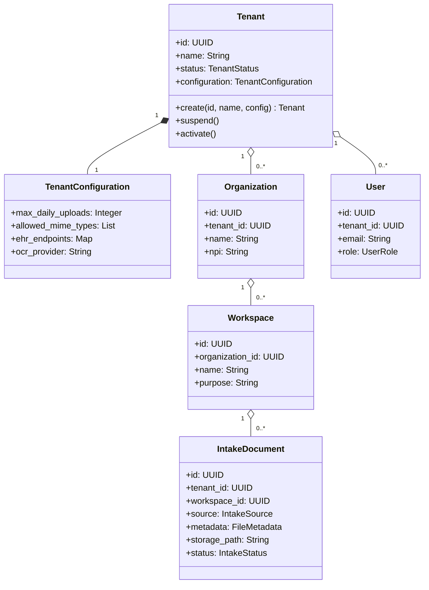
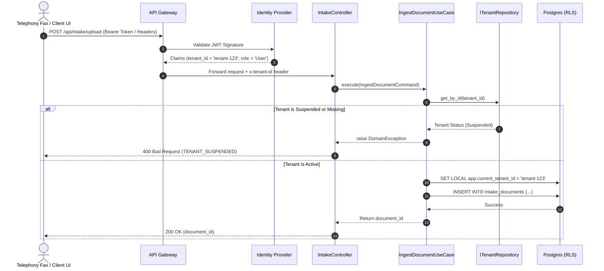

# medingest Multi-Tenant SaaS Architecture Design Specification

This document defines the architectural blueprints, hierarchical structures, isolation patterns, and scaling strategies used to transition medingest from a single-tenant document intake workflow to an enterprise-grade, multi-tenant SaaS platform.

---

## 1. Architectural Model & Domain Model

### 1.1 Tenant Model
medingest uses a **Logical Partitioning Multi-Tenancy Model** (Pooled Compute and Pooled/Partitioned Database) by default, with support for hybrid deployments. A `Tenant` represents an independent corporate entity subscribing to the SaaS platform (e.g., a hospital network or clinical group).

* **Tenant Identity**: Globally unique identifier (`tenant_id` UUIDv4) associated with a canonical organization name, billing tier, and administrative contact.
* **Tenant Configuration**: Extensible, tenant-scoped configurations controlling daily ingestion limits, allowed MIME formats, target EHR endpoint parameters (Epic, Athena, Cerner), and LLM/OCR fallback models.

### 1.2 Domain Model Aggregate Diagram
The following domain model diagram shows the boundaries and relationships between the organizations domain aggregates and the ingestion/review aggregates:



---

## 2. Structural Hierarchies

```
  ┌────────────────────────────────────────────────────────┐
  │                        Tenant                          │
  │               (Hospital Network / Group)               │
  └──────────────────────────┬─────────────────────────────┘
                             │ (1:N)
              ┌──────────────┴──────────────┐
              ▼                             ▼
     ┌─────────────────┐           ┌─────────────────┐
     │  Organization   │           │  Organization   │
     │ (Main Campus)   │           │ (West Clinic)   │
     └────────┬────────┘           └────────┬────────┘
              │ (1:N)                       │ (1:N)
       ┌──────┴──────┐               ┌──────┴──────┐
       ▼             ▼               ▼             ▼
  ┌─────────┐   ┌─────────┐     ┌─────────┐   ┌─────────┐
  │Workspace│   │Workspace│     │Workspace│   │Workspace│
  │ (Labs)  │   │(Records)│     │ (Labs)  │   │(Billing)│
  └─────────┘   └─────────┘     └─────────┘   └─────────┘
```

### 2.1 Organization Hierarchy
* **Level 1: Tenant (SaaS Subscriber)**: The root billing and compliance boundary. Users, configuration, and data scopes cannot traverse tenant boundaries.
* **Level 2: Organization (Clinical Facility)**: Represents specific physical facilities, clinics, or hospitals inside a tenant network. Holds NPI configurations and local address metadata.
* **Level 3: Workspace (Operational Queues)**: Logical operational scopes inside a facility (e.g., "Radiology Queue", "Pediatrics Records"). Documents are ingested directly into workspaces.

### 2.2 User Hierarchy & Roles
* **System Administrator (Global Admin)**: Manages tenant creation, billing tiers, global platform telemetry, and system-level configuration flags.
* **Tenant Administrator (Tenant Admin)**: Manages user access, configures API integration credentials, updates branding settings, and reviews tenant consumption metrics.
* **Clinical Reviewer (User)**: Reviews extracted fax documents, corrects metadata fields, signs off clinical summaries, and exports records to EHR systems.
* **Integration Service Account**: Programmatic API key or OAuth credential mapping external fax machines/FoIP servers to specific workspaces for headless uploads.

---

## 3. Security, Authentication, & Authorization

### 3.1 Authentication (AuthN)
All client traffic goes through an identity provider (e.g., Keycloak, Auth0) issuing JWTs.
* Every valid token contains standard OIDC claims alongside specific SaaS context attributes:
  * `tenant_id`: UUIDv4 of the associated tenant.
  * `org_id`: (Optional) User's primary facility affiliation.
  * `roles`: Array of user security roles mapping authorization capabilities.

### 3.2 Authorization (AuthZ)
We employ a hybrid **Role-Based Access Control (RBAC)** and **Attribute-Based Access Control (ABAC)** enforcement layout:
* **RBAC**: Checks if the user's role permits executing the use case (e.g., `user:write` required for `/api/intake/upload`).
* **ABAC**: Checks if the user's token `tenant_id` matches the target resource `tenant_id`. If they do not match, the application immediately rejects the request with a `403 Forbidden` response to prevent cross-tenant enumeration.

---

## 4. Tenant Isolation & Data Ownership

### 4.1 Compute Isolation
Compute resources are pooled, utilizing shared processes. The active tenant context is loaded dynamically per-request:
1. HTTP request headers or JWT tokens are resolved by an API Gateway or FastAPI routing dependencies.
2. The context is populated in a thread-local or asynchronous task variable (e.g., `contextvars` in Python).
3. Database repositories retrieve this contextual variable to partition SQL queries automatically.

### 4.2 Storage Isolation
Files (PDFs, TIFFs, JSON metadata) are stored in shared object storage buckets (AWS S3 / Google Cloud Storage) partitioned by tenant prefix:
```
s3://medingest-intake-storage/raw/{tenant_id}/{document_id}.pdf
s3://medingest-intake-storage/processed/{tenant_id}/{document_id}_ocr.json
```
The object storage IAM policies use directory-level prefixes to ensure that temporary pre-signed URLs or worker jobs can only read/write files scoped within the active `tenant_id`.

### 4.3 Database Isolation (Logical Partitioning)
* **Single Shared Database Schema**: Every database table containing tenant data includes a mandatory `tenant_id` column.
* **PostgreSQL Row-Level Security (RLS)**: RLS policies are enabled on all transactional tables:
  ```sql
  ALTER TABLE intake_documents ENABLE ROW LEVEL SECURITY;
  
  CREATE POLICY tenant_isolation_policy ON intake_documents
    USING (tenant_id = current_setting('app.current_tenant_id'));
  ```
  During database session creation, the application executes `SET LOCAL app.current_tenant_id = '...'`. PostgreSQL then transparently filters all queries, preventing cross-tenant data leaks.

### 4.4 Data Ownership
* All Patient Health Information (PHI) belongs entirely to the clinical tenant.
* **Hard Deletion**: Upon tenant deletion, the system triggers cascading hard-deletes of DB records and object storage folders scoped under `tenant_id` to comply with HIPAA right-to-be-forgotten agreements.
* **Tenant Exports**: Support bulk downloading of structured database indexes (JSON format) and original faxes (PDF) to local zip files.

---

## 5. Request & Ingestion Lifecycle

### 5.1 Request Lifecycle Flow
The following sequence diagram details the resolution and safety loops of an incoming ingestion payload:



### 5.2 Ingestion Data Flow
The following diagram illustrates data flow partitioning through system worker boundaries:

```mermaid
graph TD
    Client[Client / Telephony Webhook] -->|1. Inbound Request with Tenant Header| GW[API Gateway]
    GW -->|2. Route with Resolved Tenant Context| Controller[FastAPI Intake Controller]
    
    subgraph Compute Layer (Shared Pool)
        Controller -->|3. Validate Tenant Status| TenantRepo[(InMemory Tenant Repository)]
        Controller -->|4. Execute Ingestion Use Case| UC[IngestDocumentUseCase]
    end

    subgraph Storage Layer (Partitioned)
        UC -->|5. Save file to raw/tenant_id/doc_id.pdf| S3[(S3 Object Storage)]
        UC -->|6. Save document meta scoped by tenant_id| SQL[(PostgreSQL Database)]
    end

    subgraph Messaging (Isolated Event Routing)
        UC -->|7. Publish Ingest Event| EB[Event Bus]
        EB -->|8. Consume Event| OCR[OCR / AI Parsing Workers]
    end
```

---

## 6. Deployment & Scaling Strategies

### 6.1 Deployment Options
Depending on the customer's size and compliance requirements, medingest supports three deployment layouts:

| Model | Compute | Database | Target Customer | Cost Efficiency | Isolation Guarantee |
| :--- | :--- | :--- | :--- | :--- | :--- |
| **Pooled (SaaS)** | Shared (Pooled ECS/EKS) | Shared Schema (Logical Separation) | SMB / Standard Clinics | Maximum (Low Overhead) | Medium (Logical) |
| **Hybrid** | Shared (Pooled ECS/EKS) | Isolated database per tenant | Mid-Market / Regionals | Medium | High (Database Level) |
| **Silo (On-Prem / Private Cloud)**| Isolated ECS/EKS Cluster | Isolated database per tenant | Large Enterprise Hospitals | Low (High Overhead) | Maximum (Physical) |

### 6.2 Scaling Strategy
To maintain performance during traffic spikes across multiple active tenants, the platform implements:

* **Horizontal Database Scaling**:
  * Read replicas configured to offload query loads.
  * DB partitioning on the `tenant_id` column, allowing the database engine to prune indices and scan partitions efficiently.
* **Storage Partitioning & CDN**:
  * Temporary pre-signed URL generation with restrictive permissions ensures document downloads bypass compute bottlenecks, transferring directly from S3 bucket structures.
* **Rate Limiting (Noise Neighbor Protection)**:
  * Token bucket rate-limiting middleware configured at the API Gateway level. Limits are dynamically loaded from `TenantConfiguration` parameters to prevent a single high-volume tenant from degrading service quality for other tenants.
