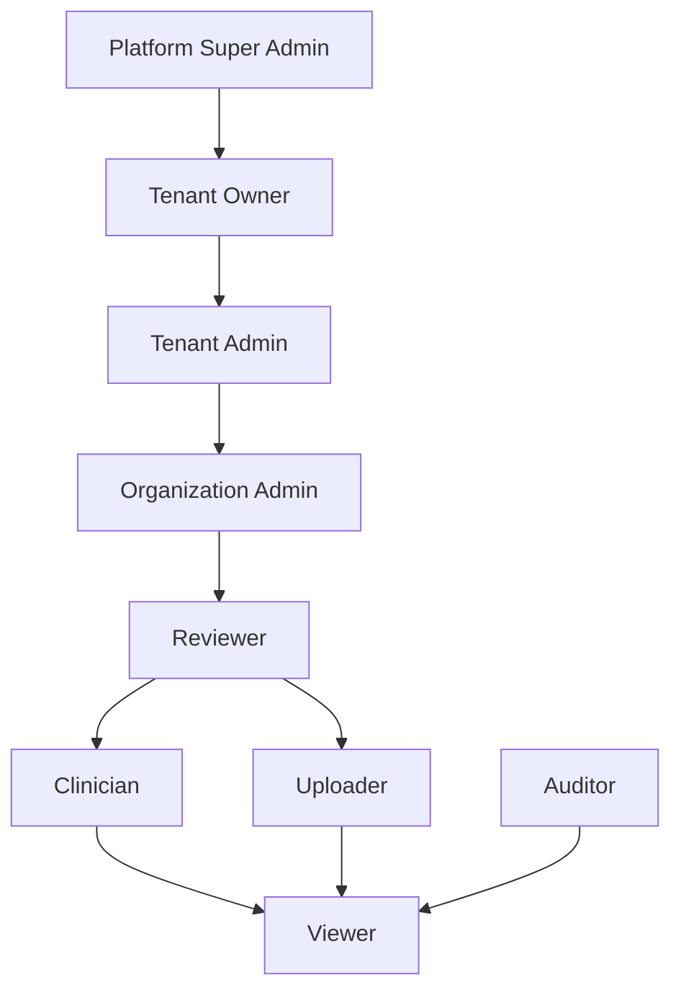

# Hierarchical RBAC & Policy Evaluation Design

This document details the authorization engine, role hierarchies, and resource-scoped policy evaluation rules designed for the DigiFax platform.

---

## 1. Role Hierarchy & Inherited Capabilities

DigiFax implements a strict **directed acyclic graph (DAG)** role hierarchy where higher-level roles inherit all capabilities and permissions of their children.

### 1.1 Granular Capability Permissions Map:
* **Viewer**: `document:read`
* **Auditor**: Inherits Viewer + `audit:read`
* **Uploader**: Inherits Viewer + `document:write`
* **Clinician**: Inherits Viewer + `fhir:read`
* **Reviewer**: Inherits Clinician and Uploader + `document:verify`, `loinc:map`
* **Organization Admin**: Inherits Reviewer + `workspace:manage`, `user:invite`
* **Tenant Admin**: Inherits Organization Admin + `billing:read`, `settings:manage`
* **Tenant Owner**: Inherits Tenant Admin + `billing:write`, `apikey:manage`
* **Platform Super Admin**: Inherits Tenant Owner + `tenant:manage`, `global:settings`

---

## 2. Policy Evaluation Flow

The authorization engine evaluates access controls in two distinct phases:

### Phase 1: RBAC Check (Capabilities Evaluation)
* Verifies if the requesting User Session holds the required permission key.
* The evaluator recursively traverses parent roles up the hierarchy tree to resolve implied/inherited permissions.

### Phase 2: ABAC Check (Resource Scoping Evaluation)
* Evaluates fine-grained ownership attributes.
* **The Rule**: Even if a user holds the `document:read` permission, they can only access the resource if:
  * `user_session.tenant_id == target_resource.tenant_id`
  * `user_session.organization_id == target_resource.organization_id` (Optional, depending on workspace configs).
* **Super Admin Exception**: System-level administrators bypass the tenant ID checks during cluster diagnostics.

---

## 3. Custom Role Support
Tenants can define custom roles dynamically:
* Each custom role maps a list of parent roles (inheriting their trees) or defines a specific array of raw permissions.
* The `AuthorizationEngine` evaluates custom roles identically by expanding their permission sets during checks.
