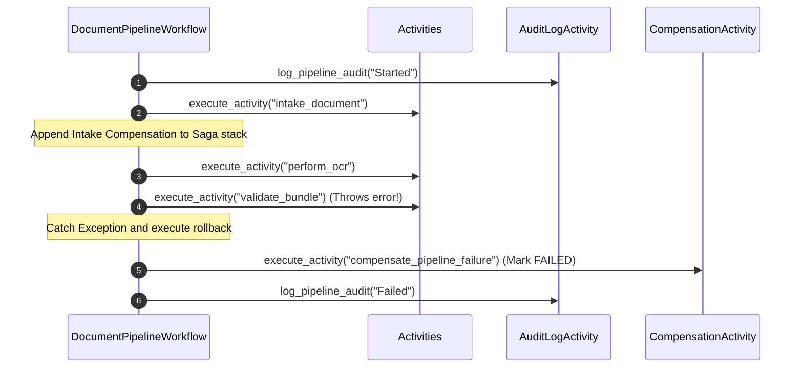

# Temporal Workflow Orchestration & Saga Compensations

This document details the multi-tenant Temporal workflow orchestration, retry policies, Saga pattern compensations, timeouts, and tracking audit logs.

---

## 1. Multi-Tenant Workflow Context Propagation

Every clinical intake pipeline runs within the scope of a validated `TenantContext`. All inputs pass trace metrics downstream:

```
  [Intake API Request]
          │
          ▼
  ┌──────────────┐
  │ TenantContext│ (tenant_id, correlation_id, trace_id, user_id)
  └──────┬───────┘
         │
         ▼
  ┌──────────────┐
  │ Temporal WF  │ (Starts workflow execution with Context parameters)
  └──────┬───────┘
         │
    ┌────┴────────────────────────┐
    ▼                             ▼
  ┌────────────────────────┐    ┌────────────────────────┐
  │   Activity 1 (OCR)     │    │  Activity 2 (FHIR)     │ (Receives tenant credentials)
  └────────────────────────┘    └────────────────────────┘
```

---

## 2. Saga Compensation Workflow

If a pipeline step fails during execution (e.g., FHIR validation throws an error or EHR export times out), the workflow catches the error and executes compensating tasks in reverse order (Saga pattern):



---

## 3. Retries, Timeouts, & Auditing Policies

### 3.1 Retry Policies
Transient errors (e.g., rate limits from OCR APIs or temporary database locks) are automatically resolved using Temporal retry policies:
* **Initial Interval**: 2 seconds.
* **Backoff Coefficient**: 2.0.
* **Maximum Attempts**: 3.

### 3.2 Timeouts
Every activity call specifies strict timeouts to prevent hanging resources:
* **OCR Extraction**: `start_to_close_timeout` = 60 seconds.
* **AI Processing**: `start_to_close_timeout` = 45 seconds.
* **FHIR Generation/Validation**: `start_to_close_timeout` = 30 seconds.
* **EHR Export**: `start_to_close_timeout` = 30 seconds.

### 3.3 Tracing & Audit Log
The `log_pipeline_audit` activity records transaction records to central trace logs containing:
* `tenant_id`
* `correlation_id`
* `trace_id`
* `user_id`
* `milestone`: Current pipeline stage (e.g., INGESTED, OCR_COMPLETED, VALIDATION_FAILED, EXPORTED, COMPLETED).
