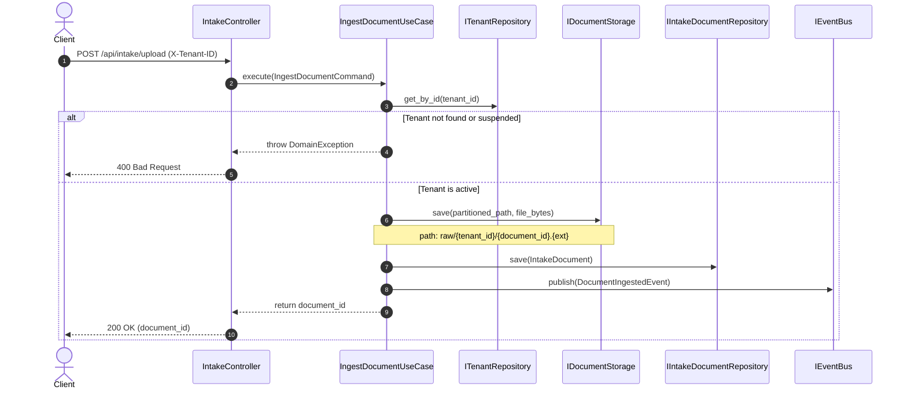

# Use Cases: Intake Pipeline

Orchestrates document ingestion, verification, partitioning, and indexing of clinical faxes and email attachments.

## Ingest Document Use Case

### Sequence Diagram

```mermaid
sequenceDiagram
    autonumber
    actor Client
    participant Controller as IntakeController
    participant UseCase as IngestDocumentUseCase
    participant TenantRepo as ITenantRepository
    participant Storage as IDocumentStorage
    participant IntakeRepo as IIntakeDocumentRepository
    participant EventBus as IEventBus

    Client->>Controller: POST /api/intake/upload (X-Tenant-ID)
    Controller->>UseCase: execute(IngestDocumentCommand)
    UseCase->>TenantRepo: get_by_id(tenant_id)
    alt Tenant not found or suspended
        UseCase-->>Controller: throw DomainException
        Controller-->>Client: 400 Bad Request
    else Tenant is active
        UseCase->>Storage: save(partitioned_path, file_bytes)
        Note over UseCase,Storage: path: raw/{tenant_id}/{document_id}.{ext}
        UseCase->>IntakeRepo: save(IntakeDocument)
        UseCase->>EventBus: publish(DocumentIngestedEvent)
        UseCase-->>Controller: return document_id
        Controller-->>Client: 200 OK (document_id)
    end
```
