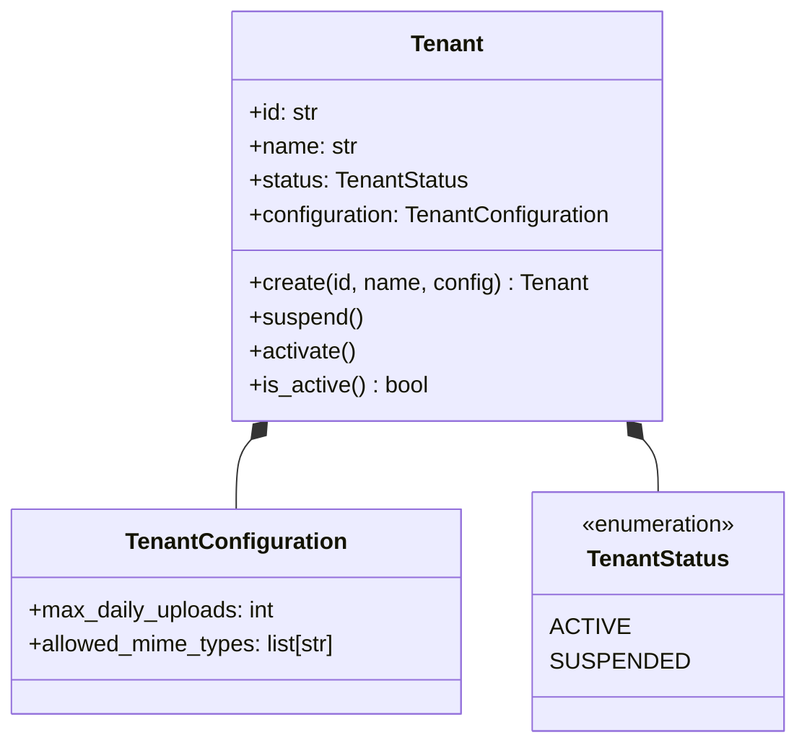

# Domain Module: Organizations

This domain module manages clinical subscriber identities, active lifecycles, and policy limits for multi-tenant SaaS operations.

## Domain Model Aggregate

```mermaid
classDiagram
    class Tenant {
        +id: str
        +name: str
        +status: TenantStatus
        +configuration: TenantConfiguration
        +create(id, name, config) Tenant
        +suspend()
        +activate()
        +is_active() bool
    }
    class TenantStatus {
        <<enumeration>>
        ACTIVE
        SUSPENDED
    }
    class TenantConfiguration {
        +max_daily_uploads: int
        +allowed_mime_types: list[str]
    }
    Tenant *-- TenantConfiguration
    Tenant *-- TenantStatus
```
